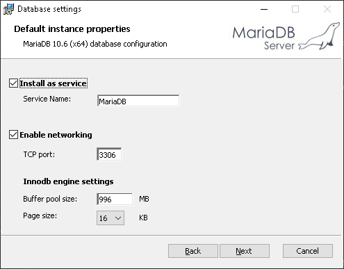

# Rock Paper Scissors game microservices

The Rock Paper Scissors game project provides infrastructure, REST and gRPC APIs for the Rock Paper Scissors game.

The Rock Paper Scissors game project uses [CQRS](https://learn.microsoft.com/en-us/azure/architecture/patterns/cqrs)
pattern. CQRS is an architectural pattern that can help maximize performance, scalability, and security. The pattern
separates operations that read data from those operations that write data.

Source: [Architecting Cloud Native .NET Applications for Azure](https://learn.microsoft.com/en-us/dotnet/architecture/cloud-native)

* [Rock Paper Scissors game command microservice](https://github.com/hokushin118/rps-microservices/tree/master/microservices/rps-cmd-service)
* [Rock Paper Scissors game query microservice](https://github.com/hokushin118/rps-microservices/tree/master/microservices/rps-qry-service)
* [Score command microservice](https://github.com/hokushin118/rps-microservices/tree/master/microservices/score-cmd-service)
* [Score query microservice](https://github.com/hokushin118/rps-microservices/tree/master/microservices/score-cmd-service)

### Prerequisites

* Java 11 or higher

### Technology stack

* [OpenJDK 11](https://openjdk.java.net/projects/jdk/11) or higher
* [Maven 3.6.3](https://maven.apache.org) or higher
* [Spring Boot 2.6.1](https://spring.io/projects/spring-boot)
* [Lombok 1.18.20](https://projectlombok.org)
* [MapStruct](https://mapstruct.org)
* [Apache ZooKeeper 3.8.0](https://zookeeper.apache.org)
* [Apache Kafka 2.7.0](https://spring.io/projects/spring-kafka)
* [MongoDB NoSQL 4.4.22](https://docs.spring.io/spring-data/mongodb/docs/current/reference/html)
* [MariaDB Community Server 10.6.14](https://mariadb.org)
* [H2 Database Engine](https://www.h2database.com)
* [OpenAPI 3.0](https://springdoc.org)
* [gRPC framework 1.32.1](https://grpc.io/docs/languages/java/quickstart)
* [Hibernate Validator](https://hibernate.org/validator/)
* [Micrometer 1.8.0](https://spring.io/blog/2018/03/16/micrometer-spring-boot-2-s-new-application-metrics-collector)
* [JUnit 5.8.2](https://junit.org/junit5/docs/current/user-guide)
* [Mockito 3.9.0](https://site.mockito.org)
* [Spock 2.1](https://spockframework.org)
* [Apache Groovy 3.0.9](https://groovy-lang.org)
* [JaCoCo](https://www.jacoco.org/jacoco) - unit and integration test coverage
* [Flyway](https://flywaydb.org) - database version control
* [Prometheus](https://prometheus.io) - metrics database
* [Grafana](https://grafana.com) - metrics visualization
* [ELK Stack](https://www.elastic.co) - log aggregation and monitoring in a centralized way
* [Redis](https://redis.io) - cache management
* [Keycloak 18.0.0](https://www.keycloak.org) - identity and access management server

** H2 in-memory database engine is used for __it__ profile only

## Local Deployment - Deploying the application locally

Microservices active profile is __dev__.

### Prerequisites

* [OpenJDK 11](https://openjdk.java.net/projects/jdk/11) or higher
* [Maven 3.6.0](https://maven.apache.org) or higher
* [Keycloak 18.0.0](https://www.keycloak.org)
* [MongoDB Community Edition](https://www.mongodb.com/docs/manual/tutorial/install-mongodb-on-windows)
* [Mongo Shell](https://www.mongodb.com/docs/v4.4/mongo/#std-label-compare-mongosh-mongo)
* [Apache ZooKeeper 3.8.0](https://zookeeper.apache.org)
* [Apache Kafka 2.7.0](https://kafka.apache.org)
* [Redis](https://redis.io)
* [MariaDB Community Server 10.6.14](https://mariadb.org)

### 1. Installing OpenJDK 11 on local machine

* Make sure you have [OpenJDK 11](https://openjdk.java.net/projects/jdk/11) or a higher version installed using the
  following command:

```
      > java -version
```

You should see the following output on Windows 10 machine:

```
      openjdk version "11.0.19" 2023-04-18
      OpenJDK Runtime Environment Temurin-11.0.19+7 (build 11.0.19+7)
      OpenJDK 64-Bit Server VM Temurin-11.0.19+7 (build 11.0.19+7, mixed mode)
```

or

```
      openjdk 11.0.19 2023-04-18                                                                                              
      OpenJDK Runtime Environment (build 11.0.19+7-post-Ubuntu-0ubuntu122.04.1)                                              
      OpenJDK 64-Bit Server VM (build 11.0.19+7-post-Ubuntu-0ubuntu122.04.1, mixed mode, sharing)     
```

on Linux Ubuntu 20.04.6 LTS machine. If not, follow the steps below to install it.

<details><summary>Windows 10</summary>

* Download and
  extract [OpenJDK11U-jdk_x64_windows_hotspot_11.0.19_7.zip](https://adoptium.net/temurin/releases/?version=11) archive
  file for Windows x64 from the [Adoptium](https://adoptium.net/temurin/releases/?version=11) website.

* Extract the contents of
  the [OpenJDK11U-jdk_x64_windows_hotspot_11.0.19_7.zip](https://adoptium.net/temurin/releases/?version=11) archive file
  to a directory of your choice. _D:\jdks_ for example.

* Add/Update __user environmental variables__. Open a __Command Prompt__ and set the value of the _JAVA_HOME_
  environment variable to your [Eclipse Temurin OpenJDK 11](https://adoptium.net/temurin/releases/?version=11) for
  Windows installation path:

```
      > setx JAVA_HOME "D:\jdks\jdk-11.0.19+7"
```

* Add the _bin_ directory contained in
  your [Eclipse Temurin OpenJDK 11](https://adoptium.net/temurin/releases/?version=11) for Windows installation path to
  the _PATH_ environment variable:

```
      > setx PATH "%JAVA_HOME%\bin;%PATH%;"
```

* Add/Update __system environmental variables__. Open a __Command Prompt__ as __Administrator__ and set the value of
  the _JAVA_HOME_ environment variable to
  your [Eclipse Temurin OpenJDK 11](https://adoptium.net/temurin/releases/?version=11) for Windows installation path:

```
      > setx -m JAVA_HOME "D:\jdks\jdk-11.0.19+7"
```

* Add the _bin_ directory contained in
  your [Eclipse Temurin OpenJDK 11](https://adoptium.net/temurin/releases/?version=11) for Windows installation path to
  the _PATH_ environment variable:

```
      > setx -m PATH "%JAVA_HOME%\bin;%PATH%;"
```

__Note:__ The _setx_ command permanently updates the environment variables. To add/update __system environment
variables__, you must use the _-m_ switch and open the command prompt using __Administrator__ privilege.

* Restart the __Command Prompt__ to reload the environment variables.

* Finally, verify that the _JAVA_HOME_ and _PATH_ environment variables are set and Java is installed:

```  
      > echo %JAVA_HOME%  
      > echo %PATH%
      > java -version
```

[Installing and using OpenJDK 11 for Windows](https://access.redhat.com/documentation/ru-ru/openjdk/11/html-single/installing_and_using_openjdk_11_for_windows/index)

</details>
<br>
<details><summary>Linux Ubuntu 20.04.6 LTS</summary>
<br>
* Install the Java Runtime Environment (JRE) from [OpenJDK 11](https://openjdk.java.net/projects/jdk/11) or higher using the following commands:

```
      > sudo apt install default-jre
```

__Note:__ By default, Ubuntu 20.04 includes [OpenJDK 11](https://openjdk.java.net/projects/jdk/11), which is an
open-source variant of the JRE and JDK.

* You can have multiple Java installations on one machine. You can configure which version is the default for use on the
  command line by using the update-alternatives command:

```
      > sudo update-alternatives --config java  
```

You should see the following output:

```
    There is only one alternative in link group java (providing /usr/bin/java): /usr/lib/jvm/java-11-openjdk-amd64/bin/java 
    Nothing to configure.
```

It means that we have only single Java installation, [OpenJDK 11](https://openjdk.java.net/projects/jdk/11), on our
machine and it's located at the _/usr/lib/jvm/java-11-openjdk-amd64/bin/java_ directory. Note this directory as you will
need it in the next step.

* Then open the _/etc/environment_ file in any text editor, nano for example, using the following command:

```
      > sudo nano /etc/environment
```

Modifying this file will set the environment variables for all users on your machine.

* At the end of the file, add the following line, making sure to replace Java path with yours obtained in the previous
  step:

```
      JAVA_HOME="/usr/lib/jvm/java-11-openjdk-amd64"
```

__Note:__ Do not include the __bin/__ portion of the Java installation location path to the _JAVA_HOME_

* Then reload this file to apply the changes to your current session with the following command:

```
      > source /etc/environment
```

* Finally, verify that the _JAVA_HOME_ environment variable is set and Java is installed:

```  
      > echo $JAVA_HOME  
      > java -version  
```

[How To Install Java with Apt on Ubuntu 20.04](https://www.digitalocean.com/community/tutorials/how-to-install-java-with-apt-on-ubuntu-20-04)

</details>

### 2. Installing Maven on local machine

* Make sure you have [Maven](https://openjdk.java.net/projects/jdk/11) or a higher version installed using the following
  command:

```
      > mvn -version
```

You should see the following output on Windows 10 machine:

```
      Apache Maven 3.9.3 (21122926829f1ead511c958d89bd2f672198ae9f)
      Maven home: D:\maven\apache-maven-3.9.3
      Java version: 11.0.19, vendor: Eclipse Adoptium, runtime: D:\jdks\jdk-11.0.19+7
      Default locale: ru_RU, platform encoding: Cp1251
      OS name: "windows 10", version: "10.0", arch: "amd64", family: "windows"
```

or

```
      Apache Maven 3.9.3 (21122926829f1ead511c958d89bd2f672198ae9f)
      Maven home: /opt/apache-maven-3.9.3
      Java version: 11.0.19, vendor: Ubuntu, runtime: /usr/lib/jvm/java-11-openjdk-amd64
      Default locale: en, platform encoding: UTF-8
      OS name: "linux", version: "5.10.102.1-microsoft-standard-wsl2", arch: "amd64", family: "unix"
```

on Linux Ubuntu 20.04.6 LTS machine. If not, follow the steps below to install it.

<details><summary>Windows 10</summary>

* Download
  the [apache-maven-3.9.3-bin.zip](https://dlcdn.apache.org/maven/maven-3/3.9.3/binaries/apache-maven-3.9.3-bin.zip)
  binary archive file from the [Apache Maven Project](https://maven.apache.org/download.cgi) website.

* Extract the contents of
  the [apache-maven-3.9.3-bin.zip](https://dlcdn.apache.org/maven/maven-3/3.9.3/binaries/apache-maven-3.9.3-bin.zip)
  archive file to a directory of your choice. _D:\maven_ for example.

* Add/Update __user environmental variables__. Open a __Command Prompt__ and set the value of the _M2_HOME_ environment
  variable for Windows installation path:

```
      > setx M2_HOME "D:\maven\apache-maven-3.9.3"
```

* Add the _bin_ directory contained in
  your [apache-maven-3.9.3-bin.zip](https://dlcdn.apache.org/maven/maven-3/3.9.3/binaries/apache-maven-3.9.3-bin.zip)
  for Windows installation path to the _PATH_ environment variable:

```
      > setx PATH "%M2_HOME%\bin;%PATH%;"
```

* Add/Update __system environmental variables__. Open a __Command Prompt__ as __Administrator__ and set the value of
  the _M2_HOME_ environment variable to
  your [apache-maven-3.9.3-bin.zip](https://dlcdn.apache.org/maven/maven-3/3.9.3/binaries/apache-maven-3.9.3-bin.zip)
  for Windows installation path:

```
      > setx -m M2_HOME "D:\maven\apache-maven-3.9.3"
```

* Add the _bin_ directory contained in
  your [apache-maven-3.9.3-bin.zip](https://dlcdn.apache.org/maven/maven-3/3.9.3/binaries/apache-maven-3.9.3-bin.zip)
  for Windows installation path to the _PATH_ environment variable:

```
      > setx -m PATH "%M2_HOME%\bin;%PATH%;"
```

* Restart the __Command Prompt__ to reload the environment variables.

* Finally, verify that the _M2_HOME_ and _PATH_ environment variables are set and Maven is installed:

```  
      > echo %M2_HOME%  
      > echo %PATH%
      > mvn -version
```

</details>
<br>
<details><summary>Linux Ubuntu 20.04.6 LTS</summary>
<br>
* Install Maven on you Linux Ubuntu machine by executing the following command:

```
      > sudo apt install maven
```

If you want to install a specific version of Maven, follow steps below.

* Download
  the [apache-maven-3.9.3-bin.tar.gz](https://dlcdn.apache.org/maven/maven-3/3.9.3/binaries/apache-maven-3.9.3-bin.tar.gz)
  binary archive file from the [Apache Maven Project](https://maven.apache.org/download.cgi) website.

```
      > wget https://dlcdn.apache.org/maven/maven-3/3.9.3/binaries/apache-maven-3.9.3-bin.tar.gz
```

* Once the download is completed, extract the downloaded file with the following commands:

```
      > tar -xvzf apache-maven-3.9.3-bin.tar.gz
```

* Move the extracted files to the _/opt_ directory with the following command:

```
      > sudo mv apache-maven-3.9.3 /opt
```

* Remove the downloaded archive:

```
      > rm apache-maven-3.9.3-bin.tar.gz
```

* Then open the _/etc/environment_ file in nano text editor, using the following command:

```
      > sudo nano /etc/environment
```

* At the end of the file, add the following line:

```
      M2_HOME="/opt/apache-maven-3.9.3"
```

* Then reload this file to apply the changes to your current session with the following command:

```
      > source /etc/environment
```

* Verify that the _JAVA_HOME_ environment variable is set:

```  
      > echo $M2_HOME  
```

You should see the following output:

```  
      /opt/apache-maven-3.9.3
```

* Add the _bin_ directory contained in maven path to the _PATH_ environment variable:

```
      > export PATH="$M2_HOME/bin:$PATH"
```

* Then reload this file to apply the changes to your current session with the following command:

```
      > source /etc/environment
```

* Finally, verify the Maven installation:

```  
      > mvn -version
```

You should see the following output:

```
      Apache Maven 3.9.3 (21122926829f1ead511c958d89bd2f672198ae9f)
      Maven home: /opt/apache-maven-3.9.3
      Java version: 11.0.19, vendor: Ubuntu, runtime: /usr/lib/jvm/java-11-openjdk-amd64
      Default locale: en, platform encoding: UTF-8
      OS name: "linux", version: "5.10.102.1-microsoft-standard-wsl2", arch: "amd64", family: "unix"
```

[How to Install Maven on Linux (Ubuntu)](https://www.digitalocean.com/community/tutorials/install-maven-linux-ubuntu)

</details>

### 3. Cloning repository to the local machine

* Clone the __rps-microservices__ project to your local machine by executing the following command:

```
      > git clone https://github.com/hokushin118/rps-microservices.git
```

### 4. Deploying Keycloak standalone server on local machine

<details><summary>Window 10</summary>

* Download and
  extract [keycloak-18.8.0.zip](https://github.com/keycloak/keycloak/releases/download/18.0.0/keycloak-18.0.0.zip)
  archive file from the [Keycloak](https://www.keycloak.org/archive/downloads-18.0.0.html) website.

* Import the _rps-dev_ realm from the _/infrastructure/keycloak/rps-dev-realm.json_ file by executing the following
  command:.

```
      > bin\kc.bat import --dir <path to root directory>\rps-microservices\infrastructure\keycloak\ --override true
```

You should see the following line in the output:

```
      2023-07-02 16:08:13,347 INFO  [org.keycloak.exportimport.util.ImportUtils] (main) Realm 'rps-dev' imported
```

* To start the [Keycloak 18.0.0](https://www.keycloak.org) in development mode, run the following command:

```
      > bin\kc.bat start-dev --http-port 8180
```

The [Keycloak 18.0.0](https://www.keycloak.org) will be started in dev mode on port number _8190_.

</details>
<br>
<details><summary>Linux Ubuntu 20.04.6 LTS</summary>
<br>
* Ensure your system is updated:

```
      > sudo apt update && sudo apt upgrade
```

* Download
  the [keycloak-18.0.0.tar.gz](https://github.com/keycloak/keycloak/releases/download/18.0.0/keycloak-18.0.0.tar.gz)
  archive file from the [Keycloak](https://www.keycloak.org/archive/downloads-18.0.0.html) website.

```
      > wget https://github.com/keycloak/keycloak/releases/download/18.0.0/keycloak-18.0.0.tar.gz
```

* Once the download is completed, extract the downloaded file with the following commands:

```
      > tar -xvzf keycloak-18.0.0.tar.gz
```

* Move the extracted files to the _/opt/keycloak_ directory with the following command:

```
      > sudo mv keycloak-18.0.0 /opt/keycloak
```

* Remove the downloaded archive:

```
      > rm keycloak-18.0.0.tar.gz
```

* Then copy the Keycloak configuration file for H2 database with the following command:

```
      > sudo cp ./infrastructure/linux/ubuntu/conf/keycloak.conf /opt/keycloak/conf/keycloak.conf
```

* Then open the _/etc/environment_ file using the following command:

```
      > sudo nano /etc/environment
```

* At the end of the file, add the following line and save the changes.

```
      KEYCLOAK_HOME="/opt/keycloak"
```

* Then reload this file to apply the changes to your current session with the following command:

```
      > source /etc/environment
```

* Finally, verify that the _KEYCLOAK_HOME_ environment variable is set:

```  
      > echo $KEYCLOAK_HOME  
```

You should see the following output:

```
      /opt/keycloak
```

* Create a separate user account (service account) for the keycloak service using the following commands:

```
      > sudo useradd keycloak -m 
      > sudo usermod --shell /bin/bash keycloak
```

__Note:__ It is considered a best practice for using a separate service account for each application. The same can be
said about creating a separate group for each service account.

* Add the user to the __sudo__ group for it to have _Administrative Privileges_ using the following command:

```
      > sudo usermod -aG sudo keycloak
```

* To verify that the _keycloak_ user has been added to the __sudo__ group run the following command:

```
      > id keycloak
```

You should see the following output:

```
      > uid=998(keycloak) gid=1003(keycloak) groups=1003(keycloak),27(sudo)
```

It means that the _keycloak_ user belongs to two groups: __keycloak__ and __sudo__.

* Hide the account from the login screen:

```
            > sudo /var/lib/AccountsService/users/keycloak
```

and add the following lines to the file:

```
            [User]
            SystemAccount=true
```

* Give the _keycloak_ user ownership of the keycloak files by executing the following command:

```
      > sudo chown -R keycloak:keycloak $KEYCLOAK_HOME
```

* [Import](https://www.keycloak.org/server/importExport) the _rps-dev_ realm from the _
  /infrastructure/keycloak/rps-dev-realm.json_ file by executing the following command:

```
      > sudo mkdir -p $KEYCLOAK_HOME/data/import && sudo cp ./infrastructure/keycloak/rps-dev-realm.json $KEYCLOAK_HOME/data/import/rps-dev-realm.json
```

You should see the following line in the output:

```
      2023-07-02 16:08:13,347 INFO  [org.keycloak.exportimport.util.ImportUtils] (main) Realm 'rps-dev' imported
```

__Note:__ Skip the next step if you are going to run [Keycloak 18.0.0](https://www.keycloak.org) as _systemd service_.

* To start the [Keycloak 18.0.0](https://www.keycloak.org) in development mode, run the following command:

```
      > sudo $KEYCLOAK_HOME/bin/kc.sh start-dev --import-realm --http-port 8180
```

The [Keycloak 18.0.0](https://www.keycloak.org) will be started in dev mode on port number _8190_.

__Note:__ When running in development mode, [Keycloak 18.0.0](https://www.keycloak.org) uses by default an H2 Database
to store its configuration.

[Keycloak on bare metal](https://www.keycloak.org/getting-started/getting-started-zip)

#### Configure Keycloak server as a systemd service for Linux Ubuntu 20.04.6 LTS

* You will need to create a _systemd service_ file to manage the Keycloak service. You can copy the sample systemd
  service with the following command:

```
      > sudo cp ./infrastructure/linux/ubuntu/systemd/keycloak.service /etc/systemd/system/keycloak.service
```

* Then, reload the _systemd daemon_ to apply the changes by executing the following command:

```
      > systemctl daemon-reload
```

* Then, start the _keycloak_ service and enable it to start at system reboot by executing the following commands:

```
      > systemctl start keycloak
      > systemctl enable keycloak
```

* You can check the status of the _keycloak_ service with the following command:

```
      > systemctl status keycloak
```

You should see the following output:

```
    keycloak.service - The Keycloak IAM (Identity and Access Management) service
         Loaded: loaded (/etc/systemd/system/keycloak.service; disabled; vendor preset: enabled)
         Active: active (running) since Sun 2023-07-09 20:21:14 MSK; 43s ago
       Main PID: 128421 (java)
          Tasks: 55 (limit: 18682)
         Memory: 345.2M
         CGroup: /system.slice/keycloak.service
                 └─128421 java -Xms64m -Xmx512m -XX:MetaspaceSize=96M -XX:MaxMetaspaceSize=256m -Djava.net.preferIPv4Stack=true -Dkc.home.dir=/opt/keycloak/bin/../ -Djboss.server.config.dir=/opt/keycloak/bi>
```

You can also view the sys logs by executing the following command:

```
      > cat /var/log/syslog 
```

You should see the following lines in the sys log file:

```
    Jul  9 20:27:14 hokushin-Latitude-3520 keycloak[128836]: 2023-07-09 20:27:14,589 WARN  [org.keycloak.quarkus.runtime.KeycloakMain] (main) Running the server in development mode. DO NOT use this configuration in production.
```

[How To Use Systemctl to Manage Systemd Services and Units](https://www.digitalocean.com/community/tutorials/how-to-use-systemctl-to-manage-systemd-services-and-units)

</details>
<br>
<details><summary>Windows 10 and Linux Ubuntu 20.04.6 LTS</summary>

#### Creating Keycloak super user account

* Open [http://localhost:8180](http://localhost:8180) and create a super user by filling the form with your preferred username and password.  


For example:

| **user name**  | **password** |
|----------------|--------------|
|     admin      |     admin    |

* Open [Keycloak admin panel](http://localhost:8180/admin), enter super user credentials and make sure that __rps-dev__
  realm and test users has successfully been imported.

[Keycloak Getting Started](https://www.keycloak.org/getting-started/getting-started-zip)  
[How to export and import Realms in Keycloak](https://www.mastertheboss.com/keycloak/how-to-export-and-import-realms-in-keycloak)

</details>

### 5. Installing MongoDB on local machine

<details><summary>Window 10</summary>

* Download and
  install [MongoDB Community Edition](https://www.mongodb.com/docs/manual/tutorial/install-mongodb-on-windows) from
  official website.

* Download and install [Mongo Shell](https://www.mongodb.com/docs/mongodb-shell/install) from official website.

</details>
<br>
<details><summary>Linux Ubuntu 20.04.6 LTS</summary>
<br>
* Ensure your system is updated:

```
      > sudo apt update && sudo apt upgrade
```

* First, import GPK key for the MongoDB apt repository on your system using the following command:

```
      > sudo apt-key adv --keyserver hkp://keyserver.ubuntu.com:80 --recv 656408E390CFB1F5
```

Then add MongoDB APT repository url in /etc/apt/sources.list.d/mongodb.list using the following command:

```
      > echo "deb [ arch=amd64,arm64 ] https://repo.mongodb.org/apt/ubuntu focal/mongodb-org/4.4 multiverse" | sudo tee /etc/apt/sources.list.d/mongodb-org-4.4.list
```

* And then, install MongoDB on your computer using the following commands:

```
      > sudo apt update
      > sudo apt install mongodb-org=4.4.22 mongodb-org-server=4.4.22 mongodb-org-shell=4.4.22 mongodb-org-mongos=4.4.22 mongodb-org-tools=4.4.22
```

* After installation, MongoDB should start automatically. if not, enable and start it using the following commands:

```
      > sudo systemctl enable mongod.service
      > sudo systemctl start mongod.service
```

* Check the status using the following command:

```
      > sudo systemctl status mongod.service
```

* Finally, check installed MongoDB version using the following command:

```
      > mongod --version
```

You should see the following output:

```
      db version v4.4.22
      Build Info: {
          "version": "4.4.22",
          "gitVersion": "fc832685b99221cffb1f5bb5a4ff5ad3e1c416b2",
          "openSSLVersion": "OpenSSL 1.1.1f  31 Mar 2020",
          "modules": [],
          "allocator": "tcmalloc",
          "environment": {
              "distmod": "ubuntu2004",
              "distarch": "x86_64",
              "target_arch": "x86_64"
          }
      }
```

* Install [Mongo Shell](https://www.mongodb.com/docs/mongodb-shell/install) on your computer using the following
  commands:

```
      > sudo apt install mongodb-mongosh=1.1.9
```

* To prevent unintended upgrades, you can pin the package at the currently installed version:

```
      echo "mongodb-org hold" | sudo dpkg --set-selections
      echo "mongodb-org-server hold" | sudo dpkg --set-selections
      echo "mongodb-mongosh hold" | sudo dpkg --set-selections
      echo "mongodb-org-mongos hold" | sudo dpkg --set-selections
      echo "mongodb-org-tools hold" | sudo dpkg --set-selections
```

* You can stop MongoDB service by executing the following command:

```
      > sudo service mongod stop
```

[Install MongoDB on Ubuntu](https://www.mongodb.com/docs/manual/tutorial/install-mongodb-on-ubuntu)

</details>
<br>
<details><summary>Windows 10 and Linux Ubuntu 20.04.6 LTS</summary>

#### Creating MongoDB root account

* Open the _command line tool_ and type the following command:

```
      > mongosh
```

You should see the following output:

```
      C:\Users\qdotn>mongosh
      Current Mongosh Log ID: 649feb5649fae114f896e903
      Connecting to:          mongodb://127.0.0.1:27017/?directConnection=true&serverSelectionTimeoutMS=2000&appName=mongosh+1.1.9
      Using MongoDB:          4.4.22
      Using Mongosh:          1.1.9
      
      For mongosh info see: https://docs.mongodb.com/mongodb-shell/
      
      
      To help improve our products, anonymous usage data is collected and sent to MongoDB periodically (https://www.mongodb.com/legal/privacy-policy).
      You can opt-out by running the disableTelemetry() command.
      
      ------
      The server generated these startup warnings when booting:
      2023-06-30T21:50:40.581+03:00: Access control is not enabled for the database. Read and write access to data and configuration is unrestricted
      ------
      
      test>
```

It means that [Mongo Shell](https://www.mongodb.com/docs/v4.4/mongo/#std-label-compare-mongosh-mongo) has successfully
been started:

* Change database to _admin_ by executing the following command
  in [Mongo Shell](https://www.mongodb.com/docs/v4.4/mongo/#std-label-compare-mongosh-mongo):

```
      > use admin
```

You should see the following output:

```
      switched to db admin
```

* To create a _root_ user with _root_ build-in role execute the following command
  in [Mongo Shell](https://www.mongodb.com/docs/v4.4/mongo/#std-label-compare-mongosh-mongo):

```
      > db.createUser(
        {
            user: "root",
            pwd: "mongo12345",
            roles: [ "root" ]
        })
```

You should see the following output:

```
      { ok: 1 }
```

It means that user _root_ user with build-in [_root_](https://www.mongodb.com/docs/manual/reference/built-in-roles) role
has successfully been created.

| **user name**  | **password** |  **role** |
|----------------|--------------|-----------|
|     root       |   mongo12345 |    root   |

MongoDB [build-in roles](https://www.mongodb.com/docs/manual/reference/built-in-roles/)

</details>

### 6. Adding custom entries to the etc/host file for the Apache Zookeeper and Kafka applications

<details><summary>Window 10</summary>
<br>
Open the _C:\windows\system32\drivers\etc\hosts_ file in any text editor and add the following entries and save the file:

```
     > 127.0.0.1 zk.internal kafka.internal
```

</details>
<br>
<details><summary>Linux Ubuntu 20.04.6 LTS</summary>
<br>
Open the _/etc/hosts_ file using the following command:

```
     > sudo nano /etc/hosts
```

Add the following entries and save the file:

```
     > 127.0.0.1 zk.internal kafka.internal
```

</details>

### 7. Deploying Apache Zookeeper on local machine

<details><summary>Window 10</summary>

* Download and
  extract [apache-zookeeper-3.8.0-bin.tar.gz](https://dlcdn.apache.org/zookeeper/zookeeper-3.8.0/apache-zookeeper-3.8.0-bin.tar.gz)
  archive file from
  the [Apache Zookeeper](https://www.apache.org/dyn/closer.lua/zookeeper/zookeeper-3.8.0/apache-zookeeper-3.8.0-bin.tar.gz)
  website.

* Open the _conf_ folder and rename the _zoo_sample.cfg_ file to the _zoo.cfg_.

* Open the _zoo.cfg_ file and make changes below:

|  **property**  |   **initial value**   |    **new value**    |
|----------------|-----------------------|---------------------|
|    dataDir     |     /tmp/zookeeper    |   D:/data/zookeeper |        
|    initLimit   |            10         |         5           |
|    syncLimit   |            5          |         2           |

* Then add the following line to the _zoo.cfg_ file and save changes.

```
      server.1=zk.internal:2888:3888
```

* Open the _command line tool_ and execute the following command to start
  the [apache-zookeeper-3.8.0](https://zookeeper.apache.org) server:

```
      > bin\zkServer.cmd
```

Note the binding port displayed in the output, it should be _2181_ by default.

```
      2023-07-01 13:37:26,687 [myid:] - INFO  [main:o.a.z.s.NIOServerCnxnFactory@660] - binding to port 0.0.0.0/0.0.0.0:2181
```

</details>
<br>
<details><summary>Linux Ubuntu 20.04.6 LTS</summary>
<br>
* Ensure your system is updated:

```
      > sudo apt update && sudo apt upgrade
```

* Download and
  extract [apache-zookeeper-3.8.0-bin.tar.gz](https://dlcdn.apache.org/zookeeper/zookeeper-3.8.0/apache-zookeeper-3.8.0-bin.tar.gz)
  archive file from
  the [Apache Zookeeper](https://www.apache.org/dyn/closer.lua/zookeeper/zookeeper-3.8.0/apache-zookeeper-3.8.0-bin.tar.gz)
  website.

```
      > sudo wget https://downloads.apache.org/zookeeper/zookeeper-3.8.0/apache-zookeeper-3.8.0-bin.tar.gz
      > sudo tar -xvzf apache-zookeeper-3.8.0-bin.tar.gz
```

* Move the extracted files to the _/opt/zookeeper_ directory with the following command:

```
      > sudo mv apache-zookeeper-3.8.0-bin /opt/zookeeper
```

* Then open the _/etc/environment_ file using the following command:

```
      > sudo nano /etc/environment
```

* At the end of the file, add the following line and save the changes.

```
      ZOOKEEPER_HOME="/opt/zookeeper"
```

* Then reload this file to apply the changes to your current session with the following command:

```
      > source /etc/environment
```

* Finally, verify that the _ZOOKEEPER_HOME_ environment variable is set:

```  
      > echo $ZOOKEEPER_HOME  
```

You should see the following output:

```
      /opt/zookeeper
```

* Create a separate user account (service account) for the zookeeper service using the following commands:

```
      > sudo useradd zookeeper -m
      > sudo usermod --shell /bin/bash zookeeper
```

* Add the user to the __sudo__ group for it to have _Administrative Privileges_ using the following command:

```
      > sudo usermod -aG sudo zookeeper
```

* Hide the account from the login screen:

```
      > sudo /var/lib/AccountsService/users/zookeeper
```

and add the following lines to the file:

```
      [User]
      SystemAccount=true
```

* Give the _zookeeper_ user ownership of the zookeeper files by executing the following command:

```
      > sudo chown -R zookeeper:zookeeper $ZOOKEEPER_HOME
```

* Create a new ZooKeeper directory to store the data on a local machine and give the _zookeeper_ user ownership to that
  directory by executing the following commands:

```
      > sudo mkdir -p /data/zookeeper
      > sudo chown -R zookeeper:zookeeper /data/zookeeper
```

* Rename the _zoo_sample.cfg_ file to the _zoo.cfg_ with the following command:

```
      > sudo mv $ZOOKEEPER_HOME/conf/zoo_sample.cfg $ZOOKEEPER_HOME/conf/zoo.cfg
```

* Open the _zoo.cfg_ file with the following command:

```
      > sudo nano $ZOOKEEPER_HOME/conf/zoo.cfg
```

* And make changes below:

|  **property**  |   **initial value**   |    **new value**    |
|----------------|-----------------------|---------------------|
|    dataDir     |     /tmp/zookeeper    |   /data/zookeeper   |        
|    initLimit   |            10         |         5           |
|    syncLimit   |            5          |         2           |

* Then add the following line to the _zoo.cfg_ file and save changes.

```
      server.1=zk.internal:2888:3888
```

* Start the [apache-zookeeper-3.8.0](https://zookeeper.apache.org) server by executing the following command:

```
      > sudo $ZOOKEEPER_HOME/bin/zkServer.sh start
```

You should see the following output:

```
      /usr/bin/java
      ZooKeeper JMX enabled by default
      Using config: /opt/zookeeper/bin/../conf/zoo.cfg
      Starting zookeeper ... STARTED  
```

[zkServer Command](https://zookeeper.apache.org/doc/r3.8.0/zookeeperTools.html#zkServer)  
[Zookeeper Admin Guide](https://zookeeper.apache.org/doc/r3.8.0/zookeeperAdmin.html)

</details>

### 8. Deploying Apache Kafka on local machine

<details><summary>Windows 10</summary>

* Download and extract [kafka_2.13-2.7.0.tgz](https://archive.apache.org/dist/kafka/2.7.0/kafka_2.13-2.7.0.tgz) archive
  file from the [Apache Kafka](https://kafka.apache.org/downloads) website.

* Open the _config_ folder and open the _server.properties_ file. Make the changes below and save the file.

|      **property**      |   **initial value**   |    **new value**     |
|------------------------|-----------------------|----------------------|
|    log.dirs            |     /tmp/kafka-logs   |   D:/data/kafka      |        
|    zookeeper.connect   |     localhost:2181    |   zk.internal:2181   |

* Then open the _config/producer.properties_ file, make the changes below and save the file.

|      **property**      |   **initial value**   |     **new value**     |
|------------------------|-----------------------|-----------------------|
|    bootstrap.servers   |     localhost:9092    |  kafka.internal:9092  |        

* Then open the _config/consumer.properties_ file, make the changes below and save the file.

|      **property**      |   **initial value**   |     **new value**     |
|------------------------|-----------------------|-----------------------|
|    bootstrap.servers   |     localhost:9092    |  kafka.internal:9092  |        

* Open the _command line tool_ and execute the following command to start
  the [apache-kafka-2.7.0](https://kafka.apache.org) server:

```
   > bin\windows\kafka-server-start.bat config\server.properties
```

</details>
<br>
<details><summary>Linux Ubuntu 20.04.6 LTS</summary>
<br>
* Ensure your system is updated:

```
      > sudo apt update && sudo apt upgrade
```

* Download and extract [kafka_2.13-2.7.0.tgz](https://archive.apache.org/dist/kafka/2.7.0/kafka_2.13-2.7.0.tgz) archive
  file from the [Apache Kafka](https://kafka.apache.org/downloads) website.

```
      > sudo wget https://archive.apache.org/dist/kafka/2.7.0/kafka_2.13-2.7.0.tgz
      > sudo tar -xvzf kafka_2.13-2.7.0.tgz
```

* Move the extracted files to the _/opt/kafka_ directory with the following command:

```
      > sudo mv kafka_2.13-2.7.0 /opt/kafka
```

* Then open the _/etc/environment_ file using the following command:

```
      > sudo nano /etc/environment
```

* At the end of the file, add the following line and save the changes.

```
      KAFKA_HOME="/opt/kafka"
```

* Then reload this file to apply the changes to your current session with the following command:

```
      > source /etc/environment
```

* Finally, verify that the _KAFKA_HOME_ environment variable is set:

```  
      > echo $KAFKA_HOME  
```

You should see the following output:

```
      /opt/kafka
```

* Create a separate user account (service account) for the kafka service using the following commands:

```
      > sudo useradd kafka -m
      > sudo usermod --shell /bin/bash kafka
```

* Add the user to the __sudo__ group for it to have _Administrative Privileges_ using the following command:

```
      > sudo usermod -aG sudo kafka
```

* Hide the account from the login screen:

```
      > sudo /var/lib/AccountsService/users/kafka
```

and add the following lines to the file:

```
      [User]
      SystemAccount=true
```

* Give the _kafka_ user ownership of the kafka files by executing the following command:

```
      > sudo chown -R kafka:kafka $KAFKA_HOME
```

* Create a new Kafka directory to store the data on a local machine and give the _kafka_ user ownership to that
  directory by executing the following commands:

```
      > sudo mkdir -p /data/kafka
      > sudo chown -R kafka:kafka /data/kafka
```

* Open the _config_ folder and open the _server.properties_ file with the following command:

```
      > sudo nano $KAFKA_HOME/config/server.properties
```

* Make changes below and save the file.

|      **property**      |   **initial value**   |    **new value**     |
|------------------------|-----------------------|----------------------|
|    log.dirs            |     /tmp/kafka-logs   |   /data/kafka      |        
|    zookeeper.connect   |     localhost:2181    |   zk.internal:2181   |

* Then open the _config/producer.properties_ file with the following command:

```
      > sudo nano $KAFKA_HOME/config/producer.properties
```

* Make the changes below and save the file.

|      **property**      |   **initial value**   |     **new value**     |
|------------------------|-----------------------|-----------------------|
|    bootstrap.servers   |     localhost:9092    |  kafka.internal:9092  |        

* Then open the _config/consumer.properties_ file with the following command:

```
      > sudo nano $KAFKA_HOME/config/consumer.properties
```

* Finally, open the _config/consumer.properties_ file, make the changes below and save the file.

|      **property**      |   **initial value**   |     **new value**     |
|------------------------|-----------------------|-----------------------|
|    bootstrap.servers   |     localhost:9092    |  kafka.internal:9092  |        

* Start the [Apache Kafka](https://kafka.apache.org/downloads) server by executing the following command:

```
      > sudo $KAFKA_HOME/bin/kafka-server-start.sh $KAFKA_HOME/config/server.properties
```

[How To Install Apache Kafka on Ubuntu 20.04](https://www.digitalocean.com/community/tutorials/how-to-install-apache-kafka-on-ubuntu-20-04)

</details>

### 9. Deploying Redis on local machine

<details><summary>Windows 10</summary>
<br>
* To install [Redis](https://redis.io) on Windows, we'll first need to [enable WSL2 (Windows Subsystem for Linux)](https://learn.microsoft.com/en-us/windows/wsl/install).

You can a list of available Linux distros by executing the following command in Windows PowerShell:

```
      > wsl --list --online
```

You'll see the following output:

```
      NAME                                   FRIENDLY NAME
      Ubuntu                                 Ubuntu
      Debian                                 Debian GNU/Linux
      kali-linux                             Kali Linux Rolling
      Ubuntu-18.04                           Ubuntu 18.04 LTS
      Ubuntu-20.04                           Ubuntu 20.04 LTS
      Ubuntu-22.04                           Ubuntu 22.04 LTS
      OracleLinux_7_9                        Oracle Linux 7.9
      OracleLinux_8_7                        Oracle Linux 8.7
      OracleLinux_9_1                        Oracle Linux 9.1
      openSUSE-Leap-15.5                     openSUSE Leap 15.5
      SUSE-Linux-Enterprise-Server-15-SP4    SUSE Linux Enterprise Server 15 SP4
      SUSE-Linux-Enterprise-Server-15-SP5    SUSE Linux Enterprise Server 15 SP5
      openSUSE-Tumbleweed                    openSUSE Tumbleweed
```

* Then you can install your favorite distro from the list by executing the following command:

```
      > wsl --install -d <DistroName>
```

for example:

```
      > wsl --install -d Ubuntu-20.04
```

* And then you can install [Redis](https://redis.io) on your Linux distro (I am using Ubuntu) by executing the following
  commands:

```
      > curl -fsSL https://packages.redis.io/gpg | sudo gpg --dearmor -o /usr/share/keyrings/redis-archive-keyring.gpg
      > echo "deb [signed-by=/usr/share/keyrings/redis-archive-keyring.gpg] https://packages.redis.io/deb $(lsb_release -cs) main" | sudo tee /etc/apt/sources.list.d/redis.list
      > sudo apt-get update
      > sudo apt-get install redis
      > sudo service redis-server start
```

</details>
<br>
<details><summary>Linux Ubuntu 20.04.6 LTS</summary>
<br>
* Ensure your system is updated:

```
      > sudo apt update && sudo apt upgrade
```

* Install [Redis](https://redis.io) on your Linux Ubuntu 20.04.6 LTS machine by executing the following commands:

```
      > curl -fsSL https://packages.redis.io/gpg | sudo gpg --dearmor -o /usr/share/keyrings/redis-archive-keyring.gpg
      > echo "deb [signed-by=/usr/share/keyrings/redis-archive-keyring.gpg] https://packages.redis.io/deb $(lsb_release -cs) main" | sudo tee /etc/apt/sources.list.d/redis.list
      > sudo apt-get update
      > sudo apt-get install redis
      > sudo service redis-server start
```

__Note:__ By default, [Redis](https://redis.io) is accessible only from _localhost_.

* To prevent unintended upgrades, you can pin the package at the currently installed version:

```
      > echo "redis hold" | sudo dpkg --set-selections
```

* Verify the status of the _redis_ package by executing the following command:

```
      > dpkg --get-selections redis
```

You should see the following output:

```
      > redis	hold
```

* You can stop [Redis](https://redis.io) service by executing the following command:

```
      > sudo service redis-server stop
```

[How To Install and Secure Redis on Ubuntu 22.04](https://www.digitalocean.com/community/tutorials/how-to-install-and-secure-redis-on-ubuntu-22-04)

</details>

### 10. Installing MariaDB on local machine

<details><summary>Windows 10</summary>
<br>
* Download and install [MariaDB Community Server](https://mariadb.com/downloads) version 10.6.14-GA for MS Windows (64-bit) from official website.

Enter _12345_ as root password. Enable the __Enable access from remote machines for 'root' user__ checkbox.

| **user name**  | **password** | 
|----------------|--------------|
|     root       |   12345      | 


Enable the __Install as service__ checkbox.



[Installing MariaDB MSI Packages on Windows](https://mariadb.com/kb/en/installing-mariadb-msi-packages-on-windows)

</details>
<br>
<details><summary>Linux Ubuntu 20.04.6 LTS</summary>
<br>
* Ensure your system is updated and install software-properties-common package:

```
      > sudo apt update && sudo apt upgrade
      > sudo apt -y install software-properties-common
```

* First, we will add the
  official [MariaDB apt repository](https://mariadb.com/kb/en/mariadb-package-repository-setup-and-usage) using the
  following command:

```
      > curl -LsS https://r.mariadb.com/downloads/mariadb_repo_setup | sudo bash -s -- --mariadb-server-version="mariadb-10.6"
```

Then, install MariaDB server and client.using the following command:

```
      > sudo apt-get install mariadb-server mariadb-client -y
```

* Check the status using the following command:

```
      > sudo systemctl status mariadb
```

* Finally, check installed MariaDB version using the following command:

```
      > mysql -V
```

You should see the following output:

```
      mysql  Ver 15.1 Distrib 10.6.14-MariaDB, for debian-linux-gnu (x86_64) using readline 5.2
```

* To prevent unintended upgrades, you can pin the package at the currently installed version:

```
      > echo "mariadb-server hold" | sudo dpkg --set-selections
      > echo "mariadb-client hold" | sudo dpkg --set-selections
```

* After installation, secure MariaDB using the following commands:

```
      > sudo mysql_secure_installation
```

You will be prompted with several questions. Choose options as shown below.

|                   **question**                             | **answer** | 
|------------------------------------------------------------|------------|
|     Enter current password for root (enter for none)       |            | 
|     Switch to unux_socket authentication [Y/n]             |     Y      | 
|     Change the root password? [Y/n]                        |     Y      | 
|     New password:                                          |   12345    | 
|     Re-enter new password:                                 |   12345    | 
|     Remove anonymous users? [Y/n]                          |     Y      | 
|     Disallow root login remotely? [Y/n]                    |     n      | 
|     Remove the test database and access to it? [Y/n]       |     Y      |
|     Reload privilege tables now? [Y/n]                     |     Y      |

* You can stop MariaDB service by executing the following command:

```
      > sudo service mariadb stop
```

[MariaDB Package Repository Setup and Usage](https://mariadb.com/kb/en/mariadb-package-repository-setup-and-usage)

</details>
<br>
<details><summary>Windows 10 and Linux Ubuntu 20.04.6 LTS</summary>

#### Validating MariaDB root account

* Validate the configurations by connecting to MariaDB:

```
      > mysql -u root -p
```

You will be prompted with password. Enter root password of 12345.

</details>

[MariaDB Data-at-Rest Encryption Overview](https://mariadb.com/kb/en/data-at-rest-encryption-overview)

### 11. Building and running the RPS game microservices on local machine

* Once the infrastructure ([backing services](https://12factor.net/backing-services)) is deployed, you can build and run
  microservices.

Each microservice has multiple profiles:

|  **profile name**  |  **is default**  |         **purpose**                |
|--------------------|------------------|------------------------------------|
|        dev         |        Yes       |  Development on local machine      |
|        docker      |        No        |  Deployment on Docker Compose      |
|        it          |        No        |  Running integration tests         |
|        prod        |        No        |  Deployment on Kubernetes cluster  |

* Execute the _mvn clean install_ command in the root directory of the project to build microservices and its
  dependencies for running on local machine.

```
      > mvn clean install
```

__Note:__ Each microservice and shared dependency should normally be hosted in its own git repository.

* Run the microservices by executing the following commands:

```
      > java -jar ./microservices/rps-cmd-service/target/rps-cmd-service.jar
      > java -jar ./microservices/rps-qry-service/target/rps-qry-service.jar
      > java -jar ./microservices/score-cmd-service/target/score-cmd-service.jar
      > java -jar ./microservices/score-qry-service/target/score-qry-service.jar
```

* Open any browser and navigate to a microservice Open API 3.0 definition (REST API).

```
      http://localhost:8081/rps-cmd-api/swagger-ui/index.html 
      http://localhost:8082/rps-qry-api/swagger-ui/index.html 
      http://localhost:8083/score-cmd-api/swagger-ui/index.html 
      http://localhost:8084/score-qry-api/swagger-ui/index.html 
```

* Click on the __Authorize__ button on the microservice Open API 3.0 definition page:


which opens a pop-up window below:


* Click on the __Authorize__ button on the pop-up window, which redirects you to the Keycloak server login page:


* Enter credentials to get appropriate access to the REST API endpoints and click on the __Sign In__ button. You will be
  redirected back to the Open API 3.0 definition page. You should see the authentication success pop-up window.


* Click the __Close__ button to close the pop-up window.

Available realm test users with corresponding roles:

| **user name**  | **password** |              **roles**             |
|----------------|--------------|------------------------------------|
|     admin      |   admin      |    __ROLE_ADMIN__, __ROLE_USER__   |
|     test       |   test       |    __ROLE_USER__                   |

__Note:__ Don't confuse __admin__ super user with realm __admin__ test user.

Available test realm roles:

|      **role**    |           **
description**                                                                            |
|------------------|------------------------------------------------------------------------------------------------------|
|   __
ROLE_ADMIN__ |  view all games, find any game by id, <br>delete any game by id, delete any score by id              | 
|   __
ROLE_USER__  |  play a game, view all games played by the user, <br>view all scores of the games played by the user |

__Notes:__ [Spring security](https://spring.io/guides/topicals/spring-security-architecture) manages endpoint access
control om microservice level.

_SecurityConfig_ and _GrpcSecurityConfig_ configuration files configure microservice endpoints access control based on
Keycloak realm users and roles.

## Docker Compose - Deploying the application on Docker Compose

Microservices active profile is __docker__.

### Prerequisites

* [Docker Desktop](https://www.docker.com/products/docker-desktop)

### 1. Installation of Docker Desktop

* Make sure you have [Docker Desktop](https://www.docker.com/products/docker-desktop) installed using the following
  command:

```
      > docker -v
```

You should see the following output:

```
      Docker version 24.0.2, build cb74dfc
```

* If [Docker Desktop](https://www.docker.com/products/docker-desktop) is not installed navigate to the docker website
  download and install it on your local machine.

<details><summary>Windows 10</summary>
<br>
* Follow the installation instructions below to install [Docker Desktop](https://www.docker.com/products/docker-desktop) on Windows 10 machine:

[Install Docker Desktop on Windows](https://docs.docker.com/desktop/install/windows-install)

</details>
<br>
<details><summary>Linux Ubuntu 20.04.6 LTS</summary>
<br>
* Follow the installation instructions below to install [Docker Desktop](https://www.docker.com/products/docker-desktop) on Linux Ubuntu machine:

[Install Docker Desktop on Ubuntu](https://docs.docker.com/desktop/install/ubuntu)

</details>

#### Setting up Docker Desktop (Windows 10 and Linux Ubuntu 20.04.6 LTS)

* [Docker Compose](https://docs.docker.com/compose) is also
  required. [Docker Desktop](https://www.docker.com/products/docker-desktop)
  includes [Docker Compose](https://docs.docker.com/compose) along with Docker Engine and Docker CLI which are Compose
  prerequisites.

[Installation scenarios](https://docs.docker.com/compose/install)

* Check if [Docker Compose](https://docs.docker.com/compose) is installed:

```
    > docker compose version
```

You should see the following output:

```
      Docker Compose version v2.18.1
```

* Check if Docker Swarm mode is active. To check it, you can simply run the command:

```
    > docker info
```

And check the status of the __Swarm__ property.

```
      Swarm: inactive
```

* If it is not active, you can simply run the command:

```
    > docker swarm init
```

to activate it.

You should see the following output:

```
      Swarm initialized: current node (1ram5oln14qdk23b08eb5iv3q) is now a manager.
      
      To add a worker to this swarm, run the following command:
      
          docker swarm join --token SWMTKN-1-0im35q3hssq4ztnp2ftcq8dvyy4zg3sfhfg0twoo80iu8mhv6s-55g0y3u102p52rrunc6our8ji 192.168.1.106:2377
      
      To add a manager to this swarm, run 'docker swarm join-token manager' and follow the instructions.
```

* Launch [Docker Desktop](https://www.docker.com/products/docker-desktop):

```
    > systemctl --user start docker-desktop
```

### 2. Deploying Keycloak standalone server on Docker Compose

<br>
<details><summary>Windows 10 and Linux Ubuntu 20.04.6 LTS</summary>
<br>

#### 2.1 Deploying Keycloak standalone server on Docker Compose

* Then navigate to the root directory of the RPS Game project on your computer and run
  the [Docker Compose](https://docs.docker.com/compose) command below to
  deploy [Keycloak 18.0.0](https://www.keycloak.org) on Docker Compose in the background:

```
    > docker compose -f docker-compose-kc.yml up -d
```

You should see the following output:

```
    [+] Running 4/4
    ✔ Network rps_net                             Created     0.2s
    ✔ Volume "rps-microservices_postgresql-data"  Created     0.0s
    ✔ Container rps-microservices-postgresql-1    Started     2.0s
    ✔ Container keycloak                          Started     2.1s
```

#### 2.2 Verifying deployment

* Verify that [Keycloak 18.0.0](https://www.keycloak.org) and [PostgreSQL](https://www.postgresql.org) containers are up
  and running by executing the following command:

```
    > docker compose -f docker-compose-kc.yml ps
```

You should see the following output:

```
    NAME                             IMAGE                                     COMMAND                  SERVICE             CREATED             STATUS              PORTS
    keycloak                         rps-microservices-keycloak                "/opt/bitnami/keyclo…"   keycloak            2 minutes ago       Up 2 minutes        0.0.0.0:28080->8080/tcp
    rps-microservices-postgresql-1   bitnami/postgresql:14.2.0-debian-10-r95   "/opt/bitnami/script…"   postgresql          2 minutes ago       Up 2 minutes        0.0.0.0:15432->5432/tcp
```

It means that [Keycloak 18.0.0](https://www.keycloak.org) and [PostgreSQL](https://www.postgresql.org) containers are up
and running.

#### 2.3 Taking down containers

* When we don't need keycloak container anymore, we can take down containers and delete their corresponding
  volumes (-v) using the down command below:

```
     > docker compose -f docker-compose-kc.yml down -v
```

</details>

### 3. Deploying MongoDB, MariaDB and Redis standalone database servers on Docker Compose

<br>
<details><summary>Windows 10 and Linux Ubuntu 20.04.6 LTS</summary>
<br>

#### 3.1 Deploying MongoDB, MariaDB and Redis standalone database servers on Docker Compose

* Navigate (if it's not already in) to the root directory of the RPS Game project on your computer and run
  the [Docker Compose](https://docs.docker.com/compose) command below to deploy standalone database servers on Docker
  Compose in the background:

```
    > docker compose -f docker-compose-general.yml up -d
```

You should see the following output:

```
    [+] Running 4/4
     ✔ Container adminer  Started     0.0s 
     ✔ Container redis    Started     0.0s 
     ✔ Container mongodb  Started     0.0s 
     ✔ Container mariadb  Started     0.0s 
```

__Note:__ [Adminer](https://www.adminer.org) database management tool is not necessary but can be useful.

#### 3.2 Verifying deployment

* Verify that [MongoDB](https://www.mongodb.com), [MariaDB](https://mariadb.org) and [Redis](https://redis.io)
  containers are up and running by executing the following command:

```
    > docker compose -f docker-compose-general.yml ps
```

You should see the following output:

```
    NAME                             IMAGE                                     COMMAND                  SERVICE             CREATED             STATUS              PORTS
    adminer                          adminer:4.8.1                             "entrypoint.sh php -…"   adminer             6 minutes ago       Up 5 minutes        0.0.0.0:19080->8080/tcp
    mariadb                          bitnami/mariadb:10.6                      "/opt/bitnami/script…"   mariadb             6 minutes ago       Up 5 minutes        0.0.0.0:13306->3306/tcp
    mongodb                          mongo:4.4                                 "docker-entrypoint.s…"   mongo               6 minutes ago       Up 5 minutes        0.0.0.0:28017->27017/tcp
    redis                            bitnami/redis:4.0.9-r24                   "/app-entrypoint.sh …"   cache               6 minutes ago       Up 5 minutes        0.0.0.0:16379->6379/tcp
```

It means that [MongoDB](https://www.mongodb.com), [MariaDB](https://mariadb.org) and [Redis](https://redis.io)
containers are up and running.

#### 3.3 Taking down containers

* When we don't need database containers anymore, we can take down containers and delete their corresponding
  volumes (-v) using the down command below:

```
     > docker compose -f docker-compose-general.yml down -v
```

</details>

### 4. Deploying Kafka cluster on Docker Compose

<br>
<details><summary>Windows 10 and Linux Ubuntu 20.04.6 LTS</summary>
<br>

#### 4.1 Deploying Kafka cluster on Docker Compose

* Navigate (if it's not already in) to the root directory of the RPS Game project on your computer and run
  the [Docker Compose](https://docs.docker.com/compose) command below to deploy Kafka cluster on Docker Compose in the
  background:

```
    > docker compose -f docker-compose-kafka.yml up -d
```

You should see the following output:

```
    [+] Running 6/6
     ✔ Container zk-3     Started     0.0s 
     ✔ Container zk-1     Started     0.0s 
     ✔ Container zk-2     Started     0.0s 
     ✔ Container kafka-3  Started     0.0s 
     ✔ Container kafka-1  Started     0.0s 
     ✔ Container kafka-2  Started     0.0s
```

#### 4.2 Verifying deployment

* Verify that Zookeeper and Kafka containers are up and running by executing the
  following [command](https://docs.docker.com/engine/reference/commandline/compose_ps):

```
    > docker compose -f docker-compose-kafka.yml ps
```

You should see the following output:

```
    NAME                             IMAGE                                     COMMAND                  SERVICE             CREATED             STATUS              PORTS
    kafka-1                          bitnami/kafka:2.7.0                       "/opt/bitnami/script…"   kafka-1             4 minutes ago       Up 3 minutes        9092/tcp, 0.0.0.0:19093->9093/tcp
    kafka-2                          bitnami/kafka:2.7.0                       "/opt/bitnami/script…"   kafka-2             4 minutes ago       Up 3 minutes        9092/tcp, 0.0.0.0:19094->9094/tcp
    kafka-3                          bitnami/kafka:2.7.0                       "/opt/bitnami/script…"   kafka-3             4 minutes ago       Up 3 minutes        9092/tcp, 0.0.0.0:19095->9095/tcp
    zk-1                             bitnami/zookeeper:3.8.0                   "/opt/bitnami/script…"   zk-1                4 minutes ago       Up 4 minutes        2888/tcp, 3888/tcp, 8080/tcp, 0.0.0.0:12181->2181/tcp
    zk-2                             bitnami/zookeeper:3.8.0                   "/opt/bitnami/script…"   zk-2                4 minutes ago       Up 4 minutes        2888/tcp, 3888/tcp, 8080/tcp, 0.0.0.0:12182->2181/tcp
    zk-3                             bitnami/zookeeper:3.8.0                   "/opt/bitnami/script…"   zk-3                4 minutes ago       Up 4 minutes        2888/tcp, 3888/tcp, 8080/tcp, 0.0.0.0:12183->2181/tcp
```

It means that Zookeeper and Kafka containers are up and running.

#### 4.3 Taking down containers

* When we don't need Kafka cluster anymore, we can take down containers and delete their corresponding
  volumes (-v) using the down command below:

```
     > docker compose -f docker-compose-kafka.yml down -v
```

</details>

### 5. Deploying RPS Game Command microservice on Docker Compose

<br>
<details><summary>Windows 10 and Linux Ubuntu 20.04.6 LTS</summary>
<br>

#### 5.1 Deploying RPS Game Command microservice on Docker Compose

* Navigate (if it's not already in) to the root directory of the RPS Game project on your computer and run
  the [Docker Compose](https://docs.docker.com/compose) command below to deploy the RPS Game Command microservice on
  Docker Compose in the background:

```
    > docker compose -f docker-compose-api-rps-cmd.yml up -d
```

You should see the following output:

```
    [+] Running 1/1
     ✔ Container rps-cmd-service  Started 
```

#### 5.2 Verifying deployment

* Verify that RPS Game Command microservice container is up and running by executing the
  following [command](https://docs.docker.com/engine/reference/commandline/compose_ps):

```
    > docker compose -f docker-compose-api-rps-cmd.yml ps
```

You should see the following output:

```
    NAME                             IMAGE                                     COMMAND                  SERVICE             CREATED             STATUS              PORTS
    rps-cmd-service                  rps-microservices-rps-cmd-service         "java -Dspring.profi…"   rps-cmd-service     2 minutes ago       Up 2 minutes        8080/tcp, 0.0.0.0:18081->80/tcp, 0.0.0.0:16566->6565/tcp
```

It means that RPS Game Command microservice is up and running.

#### 5.3 Taking down containers

* When we don't need RPS Game Command microservice anymore, we can take down container and delete their corresponding
  volumes (-v) using the down command below:

```
     > docker compose -f docker-compose-api-rps-cmd.yml down -v
```

</details>

### 6. Deploying RPS Game Query microservice on Docker Compose

<br>
<details><summary>Windows 10 and Linux Ubuntu 20.04.6 LTS</summary>
<br>

#### 6.1 Deploying RPS Game Query microservice on Docker Compose

* Navigate (if it's not already in) to the root directory of the RPS Game project on your computer and run
  the [Docker Compose](https://docs.docker.com/compose) command below to deploy the RPS Game Query microservice on
  Docker Compose in the background:

```
    > docker compose -f docker-compose-api-rps-qry.yml up -d
```

You should see the following output:

```
    [+] Running 1/1
     ✔ Container rps-qry-service  Started 
```

#### 6.2 Verifying deployment

* Verify that RPS Game Query microservice container is up and running by executing the
  following [command](https://docs.docker.com/engine/reference/commandline/compose_ps):

```
    > docker compose -f docker-compose-api-rps-qry.yml ps
```

You should see the following output:

```
    NAME                             IMAGE                                     COMMAND                  SERVICE             CREATED             STATUS              PORTS
    rps-qry-service                  rps-microservices-rps-qry-service         "java -Dspring.profi…"   rps-qry-service     2 minutes ago       Up 2 minutes        8080/tcp, 0.0.0.0:18082->80/tcp, 0.0.0.0:16567->6565/tcp
```

It means that RPS Game Query microservice is up and running.

#### 6.3 Taking down containers

* When we don't need RPS Game Query microservice anymore, we can take down container and delete their corresponding
  volumes (-v) using the down command below:

```
     > docker compose -f docker-compose-api-rps-qry.yml down -v
```

</details>

### 7. Deploying Score Command microservice on Docker Compose

<br>
<details><summary>Windows 10 and Linux Ubuntu 20.04.6 LTS</summary>
<br>

#### 7.1 Deploying Score Command microservice on Docker Compose

* Navigate (if it's not already in) to the root directory of the RPS Game project on your computer and run
  the [Docker Compose](https://docs.docker.com/compose) command below to deploy the Score Command microservice on Docker
  Compose in the background:

```
    > docker compose -f docker-compose-api-score-cmd.yml up -d
```

You should see the following output:

```
    [+] Running 1/1
     ✔ Container score-cmd-service  Started 
```

#### 7.2 Verifying deployment

* Verify that Score Command microservice container is up and running by executing the
  following [command](https://docs.docker.com/engine/reference/commandline/compose_ps):

```
    > docker compose -f docker-compose-api-score-cmd.yml ps
```

You should see the following output:

```
    NAME                             IMAGE                                     COMMAND                  SERVICE             CREATED             STATUS              PORTS
    score-cmd-service                rps-microservices-score-cmd-service       "java -Dspring.profi…"   score-cmd-service   2 minutes ago       Up 2 minutes        8080/tcp, 0.0.0.0:18083->80/tcp, 0.0.0.0:16568->6565/tcp
```

It means that Score Command microservice is up and running.

#### 7.3 Taking down containers

* When we don't need Score Command microservice anymore, we can take down container and delete their corresponding
  volumes (-v) using the down command below:

```
     > docker compose -f docker-compose-api-score-cmd.yml down -v
```

</details>

### 8. Deploying Score Query microservice on Docker Compose

<br>
<details><summary>Windows 10 and Linux Ubuntu 20.04.6 LTS</summary>
<br>

#### 8.1 Deploying Score Query microservice on Docker Compose

* Navigate (if it's not already in) to the root directory of the RPS Game project on your computer and run
  the [Docker Compose](https://docs.docker.com/compose) command below to deploy the Score Query microservice on Docker
  Compose in the background:

```
    > docker compose -f docker-compose-api-score-qry.yml up -d
```

You should see the following output:

```
    [+] Running 1/1
     ✔ Container score-qry-service  Started 
```

#### 8.2 Verifying deployment

* Verify that Score Query microservice container is up and running by executing the
  following [command](https://docs.docker.com/engine/reference/commandline/compose_ps):

```
    > docker compose -f docker-compose-api-score-qry.yml ps
```

You should see the following output:

```
    NAME                             IMAGE                                     COMMAND                  SERVICE             CREATED             STATUS              PORTS
    score-qry-service                rps-microservices-score-qry-service       "java -Dspring.profi…"   score-qry-service   2 minutes ago       Up 2 minutes        8080/tcp, 0.0.0.0:18084->80/tcp, 0.0.0.0:16569->6565/tcp
```

It means that Score Query microservice is up and running.

#### 8.3 Taking down containers

* When we don't need Score Query microservice anymore, we can take down container and delete their corresponding
  volumes (-v) using the down command below:

```
     > docker compose -f docker-compose-api-score-qry.yml down -v
```

</details>

### 9. Deploying Nginx api gateway and Health Monitoring backing service on Docker Compose

<br>
<details><summary>Windows 10 and Linux Ubuntu 20.04.6 LTS</summary>
<br>

#### 9.1 Deploying Nginx and Health Monitoring on Docker Compose

* Navigate (if it's not already in) to the root directory of the RPS Game project on your computer and run
  the [Docker Compose](https://docs.docker.com/compose) command below to deploy Nginx api gateway and [Health Monitoring](https://learn.microsoft.com/en-us/dotnet/architecture/microservices/implement-resilient-applications/monitor-app-health) backing microservice on Docker Compose in the
  background:

```
    > docker compose -f docker-compose-api.yml up -d
```

You should see the following output:

```
    [+] Running 2/2
     ✔ Container nginx        Started     0.0s 
     ✔ Container webstatus    Started     0.0s 
```

__Note:__ [Health Monitoring](https://learn.microsoft.com/en-us/dotnet/architecture/microservices/implement-resilient-applications/monitor-app-health) backing microservice is not necessary but can be useful.

#### 9.2 Verifying deployment

* Verify that Nginx and [Health Monitoring](https://learn.microsoft.com/en-us/dotnet/architecture/microservices/implement-resilient-applications/monitor-app-health) containers are up and running by executing the
  following [command](https://docs.docker.com/engine/reference/commandline/compose_ps):

```
    > docker compose -f docker-compose-api.yml ps
```

You should see the following output:

```
  NAME                             IMAGE                                     COMMAND                  SERVICE             CREATED              STATUS                          PORTS
  nginx                            rps-microservices-nginx                   "nginx -g 'daemon of…"   nginx               About a minute ago   Up About a minute   
  webstatus                        rps-microservices-webstatus               "dotnet WebStatus.dll"   webstatus           About a minute ago   Up About a minute               80/tcp, 0.0.0.0:15000->5000/tcp
```

It means that Nginx and [Health Monitoring](https://learn.microsoft.com/en-us/dotnet/architecture/microservices/implement-resilient-applications/monitor-app-health) containers are up and running.

#### 9.3 Using the Health Monitoring

* Navigate to the _health checker_ microservice:

```
    > http://localhost/status/hc-ui
```

and make sure that all the RPS game microservices are up and running.


** Status gets refreshed every _10 seconds_

#### 9.4 Taking down containers

* When we don't need Nginx and [Health Monitoring](https://learn.microsoft.com/en-us/dotnet/architecture/microservices/implement-resilient-applications/monitor-app-health) microservices anymore, we can take down containers and delete their corresponding
  volumes (-v) using the down command below:

```
     > docker compose -f docker-compose-api.yml down -v
```

</details>

### 10. Deploying Prometheus and Grafana backing service on Docker Compose

<br>
<details><summary>Windows 10 and Linux Ubuntu 20.04.6 LTS</summary>
<br>

#### 10.1 Deploying Prometheus and Grafana on Docker Compose

* Navigate (if it's not already in) to the root directory of the RPS Game project on your computer and run the [Docker Compose](https://docs.docker.com/compose) command below to deploy [Prometheus](https://prometheus.io) and [Grafana](https://prometheus.io/docs/visualization/grafana) on Docker Compose in the background:

```
    > docker compose -f docker-compose-metrics.yml up -d
```

You should see the following output:

```
    [+] Running 6/6
     ✔ Container prometheus     Started     0.0s 
     ✔ Container grafana        Started     0.0s 
```

#### 10.2 Verifying deployment

* Verify that Prometheus and Grafana containers are up and running by executing the
  following [command](https://docs.docker.com/engine/reference/commandline/compose_ps):

```
    > docker compose -f docker-compose-metrics.yml ps
```

You should see the following output:

```
  NAME                             IMAGE                                     COMMAND                  SERVICE             CREATED              STATUS                          PORTS
  grafana                          grafana/grafana:10.0.1                    "/run.sh"                grafana             About a minute ago   Up About a minute               0.0.0.0:3000->3000/tcp
  prometheus                       prom/prometheus:v2.45.0                   "/bin/prometheus --c…"   prometheus          About a minute ago   Up About a minute               0.0.0.0:9090->9090/tcp
```

It means that [Prometheus](https://prometheus.io) and [Grafana](https://prometheus.io/docs/visualization/grafana) containers are up and running.

#### 10.3 Using Prometheus

* Navigate to the _prometheus_ endpoint of microservices:

```
            http://localhost/rps-cmd-api/actuator/prometheus
            http://localhost/rps-qry-api/actuator/prometheus
            http://localhost/score-cmd-api/actuator/prometheus
            http://localhost/score-qry-api/actuator/prometheus
```

and make sure that all the RPS game microservices are exposing metrics to [Prometheus](https://prometheus.io).

* Then, navigate to the _target_ page (Status -> Targets) of the _prometheus_ microservice:

```
    > http://localhost:9090/targets
```

and make sure that [Prometheus](https://prometheus.io) is scraping from our microservices properly.


** Status gets refreshed every _5 seconds_

__Note:__ The [Prometheus](https://prometheus.io) configuration file is located at _./infrastructure/metrics/prometheus/prometheus.yml_.

#### 10.4 Using Grafana

* Navigate to the _grafana_ microservice:

```
    > http://localhost:3000
```

the login window appears. Enter credentials below:

| **user name**  | **password** |
|----------------|--------------|
|     admin      |   admin      |

and then navigate to the _Dashboards_ page:

```
    > http://localhost:3000/dashboards
```

You will see the preconfigured dashboards powered by our _prometheus datasorce_ in the list:


Select any dashboard from the list. You will be redirected to the dashboard main page. Select the application you want to monitor from the __Application__ dropdown list:


__Note:__ The [Grafana](https://grafana.com) preconfigured datasources are located at the _./infrastructure/metrics/grafana/provisioning/datasources_ folder. The preconfigured [Grafana](https://grafana.com)
dashboard templates are located at the _./infrastructure/metrics/grafana/provisioning/dashboards_ folder. You can find more dashboard templates from [Grafana Dashboards](https://grafana.com/grafana/dashboards) website.

[Grafana Tutorials](https://grafana.com/tutorials)

#### 10.5 Taking down containers

* When we don't need Prometheus and Grafana microservices anymore, we can take down containers and delete their corresponding
  volumes (-v) using the down command below:

```
     > docker compose -f docker-compose-metrics.yml down -v
```

</details>

### 3. Running the RPS game microservices deployed on Docker Compose

* Open any browser and navigate to a microservice Open API 3.0 definition (REST API).

```
            http://localhost/rps-cmd-api/swagger-ui/index.html
            http://localhost/rps-qry-api/swagger-ui/index.html
            http://localhost/score-cmd-api/swagger-ui/index.html
            http://localhost/score-qry-api/swagger-ui/index.html
```

__Note:__ NGINX is used as API gateway so if you deploy the microservices on docker containers you should remove port
number from the url.

***

From experience, [Docker Compose](https://docs.docker.com/compose) is a great option for small-scale applications that
don't require a lot of infrastructure. It's easy to use and can be deployed quickly. It also a great tool for local
development.

However, [Docker Compose](https://docs.docker.com/compose) is not as scalable as Kubernetes and is not that suitable for
developing large-scale applications. Kubernetes is a more complex but more powerful deployment technique.

[Docker Compose](https://docs.docker.com/compose) vs K8S, pros and cons:

[Docker Swarm vs Kubernetes: how to choose a container orchestration tool](https://circleci.com/blog/docker-swarm-vs-kubernetes)
[Kubernetes vs Docker: A comprehensive comparison](https://www.civo.com/blog/kubernetes-vs-docker-a-comprehensive-comparison)

***

## Kubernetes (K8S) - Deploying the application on Kubernetes

Microservices active profile is __prod__.

### Prerequisites

Make sure that k8s is enabled in the [Docker Desktop](https://www.docker.com/products/docker-desktop). If not, click on
the __Settings__ icon, then on the __Kubernetes__
tab and check the __Enable Kubernetes__ checkbox.


You can also use [minikube](https://minikube.sigs.k8s.io/docs/start) for local K8S development.

Make sure Minikube, kubectl and helm are installed.

[kubectl installation](https://kubernetes.io/docs/tasks/tools/install-kubectl)
[Minikube installation](https://minikube.sigs.k8s.io/docs/start)
[Helm installation](https://helm.sh/docs/intro/install)
[How To Install Minikube on Ubuntu 22.04|20.04|18.04](https://computingforgeeks.com/how-to-install-minikube-on-ubuntu-debian-linux)
[How To Install Docker On Ubuntu 22.04 | 20.04](https://cloudcone.com/docs/article/how-to-install-docker-on-ubuntu-22-04-20-04)

Start minikube cluster:

```
     > minikube start \
            --addons=ingress,dashboard \
            --cni=flannel \
            --install-addons=true \
                --kubernetes-version=stable \
                --vm-driver=docker --wait=false \
                --cpus=4 --memory=6g --nodes=1 \
                --extra-config=apiserver.service-node-port-range=1-65535 \
            --embed-certs \
            --no-vtx-check \
            --docker-env HTTP_PROXY=https://minikube.sigs.k8s.io/docs/reference/networking/proxy/
```

__Note:__ The infrastructure clusters require significant resources (CPUs, memory). I have the following server
configuration:

```
     OS: Ubuntu 22.04.2 LTS (Jammy Jellyfish)
     Processor: Intel Xeon Processor (Icelake) 2GHz 16Mb
     vCPU: 4
     RAM: 32
```

Make sure Minikube is up and running with the following command:

```
     > minikube status
```

You should see the following output:

```
      minikube
      type: Control Plane
      host: Running
      kubelet: Running
      apiserver: Running
      kubeconfig: Configured
```

Verify that _metrics-server_ is installed by executing the following command:

```
      > minikube addons list | grep metrics-server
```

If not, you should see the following output:

```
      | metrics-server              | minikube | disabled     | Kubernetes   
```

To install _metrics-server_ on your K8S cluster, run:

```
      > minikube addons enable metrics-server
```

You should see the following output:

```
      You can view the list of minikube maintainers at: https://github.com/kubernetes/minikube/blob/master/OWNERS
      - Using image registry.k8s.io/metrics-server/metrics-server:v0.6.3
      * The 'metrics-server' addon is enabled
```

Verify that _metrics-server_ pod is up and running:

```
      > kubectl get pods -n kube-system | grep metrics-server
```

You should see the following output:

```
      metrics-server-6588d95b98-bdb6x    1/1     Running   0             2m35s
```

It means that _metrics-server_ is up and running.

Now, if you run the following command:

```
      > kubectl top pod -n rps-app-dev
```

You should see resources used in specified namespace:

```
      NAME                                           CPU(cores)   MEMORY(bytes)
      rps-cmd-service-deployment-59bc84c8-bcx4b      1m           573Mi
      rps-qry-service-deployment-9b4fbc8f6-vw58g     3m           590Mi
      score-cmd-service-deployment-676c56db8-rpfbc   1m           389Mi
```

Now that you are certain everything is up and running deploy the Kubernetes Dashboard with the command:

```
     > minikube dashboard
```

If you want to access the K8S Dashboard from outside the cluster, run the following command:

```
      > kubectl proxy --address='0.0.0.0' --accept-hosts='^*$'
```

And then access the K8S Dashboard in any browser:

```
      http://<ip of your hosting server>:8001/api/v1/namespaces/kubernetes-dashboard/services/http:kubernetes-dashboard:/proxy/#/workloads?namespace=default
```

Open a __Command Prompt__ and check if access is available for your Minikube cluster:

```
     > kubectl cluster-info
```

You should see the following output:

```
      Kubernetes control plane is running at https://192.168.49.2:8443
      CoreDNS is running at https://192.168.49.2:8443/api/v1/namespaces/kube-system/services/kube-dns:dns/proxy
      
      To further debug and diagnose cluster problems, use 'kubectl cluster-info dump'.
```

Check the state of your Minikube cluster:

```
     > kubectl get nodes
```

The output will list all of a cluster’s nodes and the version of Kubernetes each one is running.

```
      NAME       STATUS   ROLES           AGE     VERSION
      minikube   Ready    control-plane   7d14h   v1.26.3
```

You should see a single node in the output called _minikube_. That’s a full K8S cluster, with a single node.

First, we have to set up our infrastucture.

### Elasticsearch, Logstash and Kibana (ELK Stack) on K8S cluster

There are several ways we can implement the __ELK Stack__ architecture pattern:

1. __Beats__ —> __Elasticsearch__ —> __Kibana__

2. __Beats__ —> __Logstash__ —> __Elasticsearch__ —> __Kibana__

3. __Beats__ —> __Kafka__ —> __Logstash__ —> __Elasticsearch__ —> __Kibana__

Here we implement the first and second approaches. The last one is the better option for production environment cause
Kafka acts as a data buffer and helps prevent data loss or interruption while streaming files quickly.

_ELK Stack_ is used to implement the following patterns:

* [Log aggregation](https://microservices.io/patterns/observability/application-logging.html)
* [Sharding](https://learn.microsoft.com/en-us/azure/architecture/patterns/sharding)

#### 1. Creating namespace for ELK services

To create a _kube-elk_ namespace on the K8S cluster, run:

```
     > kubectl apply -f ./k8s/namespaces/kube-elk-ns.yml
```

__Note:__ In Kubernetes, [namespaces](https://kubernetes.io/docs/concepts/overview/working-with-objects/namespaces)
provides a mechanism for isolating groups of resources within a single cluster. However not all objects are in a
namespace.

To check the status, run:

```
     > kubectl get namespaces --show-labels
```

You should see the following output:

```
      NAME                   STATUS   AGE     LABELS
      default                Active   2d13h   kubernetes.io/metadata.name=default
      ingress-nginx          Active   2d13h   app.kubernetes.io/instance=ingress-nginx,app.kubernetes.io/name=ingress-nginx,kubernetes.io/metadata.name=ingress-nginx
      kube-elk               Active   2d12h   kubernetes.io/metadata.name=kube-elk,name=kube-elk
      kube-node-lease        Active   2d13h   kubernetes.io/metadata.name=kube-node-lease
      kube-public            Active   2d13h   kubernetes.io/metadata.name=kube-public
      kube-system            Active   2d13h   kubernetes.io/metadata.name=kube-system
      kubernetes-dashboard   Active   2d13h   addonmanager.kubernetes.io/mode=Reconcile,kubernetes.io/metadata.name=kubernetes-dashboard,kubernetes.io/minikube-addons=dashboard
```

#### 2. Deploying Elasticsearch cluster

_Elasticsearch is the core component of ELK. It works as a searchable database for log files._

To deploy elasticsearch cluster to Kubernetes, first run:

```
     > kubectl apply -f ./k8s/rbacs/elasticsearch-rbac.yml
```

Then deploy a headless service for _Elasticsearch_ pods using the following command:

```
     > kubectl apply -f ./k8s/services/elasticsearch-svc.yml
```

__Note:__ You cannot directly access the application running in the pod. If you want to access the application, you need
a Service object in the Kubernetes cluster.

_Headless_ service means that only internal pods can communicate with each other. They are not exposed to external
requests outside the Kubernetes cluster. _Headless_ services should be used when client applications or pods want to
communicate with specific (not randomly selected) pod (stateful application scenarios).

And then run:

```
     > kubectl apply -f ./k8s/sets/elasticsearch-statefulset.yml
```

To monitor the deployment status, run:

```
     > kubectl rollout status sts/elasticsearch-sts -n kube-elk
```

To check the pod status, run:

```
     > kubectl get pods -n kube-elk
```

You should see the following output:

```
      NAME                                   READY   STATUS    RESTARTS         AGE
      elasticsearch-sts-0                    1/1     Running   0                16m
      elasticsearch-sts-1                    1/1     Running   0                15m
      elasticsearch-sts-2                    1/1     Running   0                15m
```

To access the Elasticsearch locally, we have to forward a local port 9200 to the Kubernetes node running Elasticsearch
with the following command:

```
     > kubectl port-forward <elasticsearch pod> 9200:9200 -n kube-elk
```

In our case:

```
     > kubectl port-forward elasticsearch-sts-0 9200:9200 -n kube-elk
```

You should see the following output:

```
      Forwarding from 127.0.0.1:9200 -> 9200
      Forwarding from [::1]:9200 -> 9200
```

The command forwards the connection and keeps it open. Leave the terminal window running and proceed to the next step.

In another terminal tab, test the connection with the following command:

```
     > curl localhost:9200
```

The output prints the deployment information.

Alternatively, access localhost:9200 from the browser. The output shows the cluster details in JSON format, indicating
the deployment is successful.

You may also check the health of your Elasticsearch cluster with this command:

```
     > curl localhost:9200/_cluster/health?pretty
```

You should see the following output:

```
    {
      "cluster_name" : "k8s-logs",
      "status" : "green",
      "timed_out" : false,
      "number_of_nodes" : 1,
      "number_of_data_nodes" : 1,
      "active_primary_shards" : 0,
      "active_shards" : 0,
      "relocating_shards" : 0,
      "initializing_shards" : 0,
      "unassigned_shards" : 0,
      "delayed_unassigned_shards" : 0,
      "number_of_pending_tasks" : 0,
      "number_of_in_flight_fetch" : 0,
      "task_max_waiting_in_queue_millis" : 0,
      "active_shards_percent_as_number" : 100.0
    }
```

You may also check the state of your Elasticsearch cluster with this command:

```
     > curl localhost:9200/_cluster/state?pretty
```

You may also check the log of your Elasticsearch cluster pod with this command:

```
     > kubectl logs <pod name> -n kube-elk
```

Or container inside your Elasticsearch cluster pod with this command:

```
     > kubectl logs <pod name> -c <container name> -n kube-elk
```

#### 3. Deploying Filebeat

_Filebeat is used to farm all the logs from all our nodes and pushing them to Elasticsearch._

To deploy Filebeat to Kubernetes, first run:

```
     > kubectl apply -f ./k8s/rbacs/filebeat-rbac.yml
```

Then run:

```
     > kubectl apply -f ./k8s/configmaps/filebeat-configmap.yml
```

__Note:__ If you are running the __Beats__ —> __Elasticsearch__ —> __Kibana__ scenario, go to the filebeat-configmap.yml
file and make the changes below before deploying:

```
    # Send events directly to Elasticsearch cluster
    output.elasticsearch:
     hosts: ['${FILEBEAT_ELASTICSEARCH_URL:elasticsearch-svc.kube-elk}']
     username: ${FILEBEAT_ELASTICSEARCH_USERNAME}
     password: ${FILEBEAT_ELASTICSEARCH_PASSWORD}

    # Send events to Logstash
    # output.logstash:
    #  hosts: ['${FILEBEAT_LOGSTASH_URL:logstash-svc.kube-elk}']
```

And then run:

```
     > kubectl apply -f ./k8s/sets/filebeat-daemonset.yml
```

Verify that the Filebeat DaemonSet rolled out successfully using kubectl:

```
     > kubectl get ds -n kube-elk
```

You should see the following status output:

```
      NAME           DESIRED   CURRENT   READY   UP-TO-DATE   AVAILABLE   NODE SELECTOR   AGE
      filebeat-dst   1         1         1       1            1           <none>          135m
```

To verify that Elasticsearch is indeed receiving this data, query the Filebeat index with this command:

```
     > curl http://localhost:9200/filebeat-*/_search?pretty
```

You can also make sure that filebeat container is up and running by viewing logs:

```
     > kubectl logs <filebeat pod name> -c filebeat -n kube-elk -f
```

#### 4. Deploying Logstash

_Logstash is used for ingesting data from a multitude of sources, transforming it, and then sending it to
Elasticsearch._

__Note:__ Skip this step if you are running the __Beats__ —> __Elasticsearch__ —> __Kibana__ scenario.

To deploy Logstash to Kubernetes, first run:

```
     > kubectl apply -f ./k8s/services/logstash-svc.yml
```

Then run:

```
     > kubectl apply -f ./k8s/configmaps/logstash-configmap.yml
```

And then run:

```
     > kubectl apply -f ./k8s/deployments/logstash-deployment.yml
```

To check the status, run:

```
     > kubectl get deployment/logstash-deployment -n kube-elk
```

You should see the following output:

```
      NAME                  READY   UP-TO-DATE   AVAILABLE   AGE
      logstash-deployment   1/1     1            1           26m
```

Make sure that logstash container is up and running by viewing pod's _logstash_ container logs:

```
     > kubectl logs <logstash pod name> -c logstash -n kube-elk -f
```

Logstash also provides [monitoring APIs](https://www.elastic.co/guide/en/logstash/current/monitoring-logstash.html) for
retrieving runtime metrics about Logstash. By default, the monitoring API attempts to bind to port _tcp:9600_. So, to
access the Logstash monitoring API, we have to forward a local port _9600_ to the Kubernetes node running Logstash with
the following command:

```
     > kubectl port-forward <logstash pod name> 9600:9600 -n kube-elk
```

You should see the following output:

```
      Forwarding from 127.0.0.1:9600 -> 9600
      Forwarding from [::1]:9600 -> 9600
```

Now You can use the root resource to retrieve general information about the Logstash instance, including the host and
version with the following command:

```
     > curl localhost:9600/?pretty
```

You should see the following output:

```
      {
        "host" : "logstash",
        "version" : "6.8.23",
        "http_address" : "0.0.0.0:9600",
        "id" : "5db8766c-2737-47cc-80c6-26c3621604ec",
        "name" : "logstash",
        "build_date" : "2022-01-06T20:30:42Z",
        "build_sha" : "2d726680d98e4e6dfb093ff1a39cc1c0bf1d1ef5",
        "build_snapshot" : false
      }
```

#### 5. Deploying Kibana

_Kibana is a visualization tool. It uses a web browser interface to organize and display data._

To deploy Kibana to Kubernetes, first run:

```
     > kubectl apply -f ./k8s/configmaps/kibana-configmap.yml
```

Then run:

```
     > kubectl apply -f ./k8s/services/kibana-svc.yml
```

And then run:

```
     > kubectl apply -f ./k8s/deployments/kibana-deployment.yml
```

To access the Kibana interface, we have to forward a local port _5601_ to the Kubernetes node running Kibana with the
following command:

```
     > kubectl port-forward <kibana pod> 5601:5601 -n kube-elk
```

The command forwards the connection and keeps it open. Leave the terminal window running and proceed to the next step.

To check the state of the deployment, in another terminal tab, perform the following request against the Elasticsearch
REST API:

```
     > curl localhost:9200/_cat/indices?v 
```

__Note:__ If you are running a single node cluster ([Docker Desktop](https://www.docker.com/products/docker-desktop) or
MiniKube) you might need to perform the following request against the Elasticsearch REST API::

```
     > curl --location --request PUT 'localhost:9200/_settings' \
       --header 'Content-Type: application/json' \
       --data '{
           "index": {
               "number_of_replicas": 0
           }
       }'
```

You should see the following output:

```
      health status index                      uuid                   pri rep docs.count docs.deleted store.size pri.store.size
      green  open   .kibana                    fP_HM1riQWGKpkl8FuGFTA   1   0          2            0     10.4kb         10.4kb
      green  open   .kibana_1                  g2SMz8XjShmSzTwmOQu9Fw   1   0          0            0       261b           261b
      green  open   .kibana_2                  2Poc2zmRRwawJNBO8Xeamg   1   0          0            0       261b           261b
      green  open   .kibana_task_manager       RgTFfA6lQ_CoSVUW8NbZGQ   1   0          2            0     19.2kb         19.2kb
      green  open   logstash-2023.05.27        sNFgElHBTbSbapgYPYk9Cw   5   0     132000            0     28.6mb         28.6mb
```

__Note:__ If you are running the __Beats__ —> __Logstash__ —> __Elasticsearch__ —> __Kibana__ scenario.

```
      health status index                      uuid                   pri rep docs.count docs.deleted store.size pri.store.size
      green  open   .kibana                    fP_HM1riQWGKpkl8FuGFTA   1   0          2            0     10.4kb         10.4kb
      green  open   .kibana_1                  g2SMz8XjShmSzTwmOQu9Fw   1   0          0            0       261b           261b
      green  open   .kibana_2                  2Poc2zmRRwawJNBO8Xeamg   1   0          0            0       261b           261b
      green  open   .kibana_task_manager       RgTFfA6lQ_CoSVUW8NbZGQ   1   0          2            0     19.2kb         19.2kb
      green  open   filebeat-6.8.23-2023.05.20 EUSLOZMWQGSyWMrh2EJiRA   5   0     122481            0     34.2mb         34.2mb
```

__Note:__ If you are running the __Beats__ —> __Elasticsearch__ —> __Kibana__ scenario.

And then access the Kibana UI in any browser:

```
     > http://localhost:5601
```

In Kibana, navigate to the __Management__ -> __Kibana Index Patterns__. Kibana should display the Filebeat index.

Enter __"logstash-*"__ or __"filebeat-*"__ (depending on running ELK pattern) as the index pattern, and in the next step
select @timestamp as your Time Filter field.

Navigate to the Kibana dashboard and in the __Discovery__ page, in the search bar enter:

```
     > kubernetes.pod_name:<name of the pod>
```

You should see a list of log entries for the specified pod.

#### 5. Deploying CronJob

_Elasticsearch cron job is used for clearing Elasticsearch indices._

To deploy Elasticsearch cron job to Kubernetes, first run:

```
     > kubectl apply -f ./k8s/configmaps/curator-configmap.yml
```

And then run:

```
     > kubectl apply -f ./k8s/cronjobs/curator-cronjob.yml
```

Verify that the Elasticsearch cron job rolled out successfully using kubectl:

```
     > kubectl get cronjobs -n kube-elk
```

You should see the following status output:

```
      NAME              SCHEDULE    SUSPEND   ACTIVE   LAST SCHEDULE   AGE
      curator-cronjob   0 0 1 * *   False     0        <none>          22m

```

### MariaDB database on K8S cluster

_MariaDB_ Server is one of the most popular open source relational databases.

_MongoDB_ is used to implement the following patterns:

* [CQRS](https://learn.microsoft.com/en-us/azure/architecture/patterns/cqrs)
* [Database per service](https://microservices.io/patterns/data/database-per-service.html)
* [Index Table](https://learn.microsoft.com/en-us/azure/architecture/patterns/index-table)

#### 1. Creating namespace for MariaDB database

To create a _kube-db_ namespace on the k8s cluster, run:

```
     > kubectl apply -f ./k8s/namespaces/kube-db-ns.yml
```

To check the status, run:

```
     > kubectl get namespaces --show-labels
```

You should see the following output:

```
      NAME                   STATUS   AGE     LABELS
      default                Active   2d13h   kubernetes.io/metadata.name=default
      ingress-nginx          Active   2d13h   app.kubernetes.io/instance=ingress-nginx,app.kubernetes.io/name=ingress-nginx,kubernetes.io/metadata.name=ingress-nginx
      kube-db                Active   99m     kubernetes.io/metadata.name=kube-db,name=kube-db
      kube-elk               Active   2d12h   kubernetes.io/metadata.name=kube-elk,name=kube-elk
      kube-node-lease        Active   2d13h   kubernetes.io/metadata.name=kube-node-lease
      kube-public            Active   2d13h   kubernetes.io/metadata.name=kube-public
      kube-system            Active   2d13h   kubernetes.io/metadata.name=kube-system
      kubernetes-dashboard   Active   2d13h   addonmanager.kubernetes.io/mode=Reconcile,kubernetes.io/metadata.name=kubernetes-dashboard,kubernetes.io/minikube-addons=dashboard
```

#### 2. Deploying MariaDB cluster

To deploy MariaDB cluster to Kubernetes, first run:

```
     > kubectl apply -f ./k8s/rbacs/mariadb-rbac.yml
```

Then run:

```
     > kubectl apply -f ./k8s/configmaps/mariadb-configmap.yml
```

Then deploy a headless service for _MariaDB_ pods using the following command:

```
     > kubectl apply -f ./k8s/services/mariadb-svc.yml
```

__Note:__ You cannot directly access the application running in the pod. If you want to access the application, you need
a Service object in the Kubernetes cluster.

_Headless_ service means that only internal pods can communicate with each other. They are not exposed to external
requests outside the Kubernetes cluster. _Headless_ services expose the individual pod IPs instead of the service IP and
should be used when client applications or pods want to communicate with specific (not randomly selected) pod (stateful
application scenarios).

Get the list of running services under the __kube-db__ namespace with the following command:

```
     > kubectl get service -n kube-db
```

You should see the following output:

```
      NAME          TYPE        CLUSTER-IP   EXTERNAL-IP   PORT(S)    AGE
      mariadb-svc   ClusterIP   None         <none>        3306/TCP   113s
```

Then run:

```
     > kubectl apply -f ./k8s/secrets/mariadb-secret.yml
```

Now the secrets can be referenced in our statefulset. And then run:

```
     > kubectl apply -f ./k8s/sets/mariadb-statefulset.yml
```

To monitor the deployment status, run:

```
     > kubectl rollout status sts/mariadb-sts -n kube-db
```

You should see the following output:

```
      partitioned roll out complete: 3 new pods have been updated...
```

To check the pod status, run:

```
     > kubectl get pods -n kube-db
```

You should see the following output:

```
      NAME            READY   STATUS    RESTARTS   AGE
      mariadb-sts-0   1/1     Running   0          108s
      mariadb-sts-1   1/1     Running   0          105s
      mariadb-sts-2   1/1     Running   0          102s
```

#### 3. Testing MariaDB cluster replication

At this point, your MariaDB cluster is ready for work. Test it as follows:

Create data on first (primary) replica set member with these commands:

```
     > kubectl -n kube-db exec -it mariadb-sts-0 -- mariadb -uroot -p12345 
```

You should see the following output:

```
      Defaulted container "mariadb" out of: mariadb, init-mariadb (init)
      Welcome to the MariaDB monitor.  Commands end with ; or \g.
      Your MariaDB connection id is 6
      Server version: 10.11.3-MariaDB-1:10.11.3+maria~ubu2204-log mariadb.org binary distribution
      
      Copyright (c) 2000, 2018, Oracle, MariaDB Corporation Ab and others.
      
      Type 'help;' or '\h' for help. Type '\c' to clear the current input statement.
      
      MariaDB [(none)]> show databases;
      +--------------------+
      | Database           |
      +--------------------+
      | information_schema |
      | mysql              |
      | performance_schema |
      | primary_db         |
      | sys                |
      +--------------------+
      5 rows in set (0.001 sec)
      
      MariaDB [(none)]> use primary_db;
      Database changed
      MariaDB [primary_db]> create table my_table (t int); insert into my_table values (5),(15),(25);
      Query OK, 0 rows affected (0.041 sec)
      
      Query OK, 3 rows affected (0.007 sec)
      Records: 3  Duplicates: 0  Warnings: 0
      MariaDB [primary_db]> exit
      Bye
```

Check data on second (secondary) replica set member with these commands:

```
     > kubectl -n kube-db exec -it mariadb-sts-1 -- mariadb -uroot -p12345 
```

You should see the following output:

```
      Defaulted container "mariadb" out of: mariadb, init-mariadb (init)
      Welcome to the MariaDB monitor.  Commands end with ; or \g.
      Your MariaDB connection id is 6
      Server version: 10.11.3-MariaDB-1:10.11.3+maria~ubu2204 mariadb.org binary distribution
      
      Copyright (c) 2000, 2018, Oracle, MariaDB Corporation Ab and others.
      
      Type 'help;' or '\h' for help. Type '\c' to clear the current input statement.
      
      MariaDB [(none)]> show databases;
      +--------------------+
      | Database           |
      +--------------------+
      | information_schema |
      | mysql              |
      | performance_schema |
      | primary_db         |
      | sys                |
      +--------------------+
      5 rows in set (0.001 sec)
      
      MariaDB [(none)]> use primary_db;
      Database changed
      MariaDB [primary_db]> show tables;
      +----------------------+
      | Tables_in_primary_db |
      +----------------------+
      | my_table             |
      +----------------------+
      1 row in set (0.000 sec)
      MariaDB [primary_db]> select * from my_table;
      +------+
      | t    |
      +------+
      |    5 |
      |   15 |
      |   25 |
      +------+
      3 rows in set (0.000 sec)
```

Repeat the same steps for the third (secondary) replica set member by changing the name of the pod to _mariadb-sts-2_.

### MongoDB database on K8S cluster

_MongoDB_ is a source-available cross-platform document-oriented database program.

_MongoDB_ is used to implement the following patterns:

* [CQRS](https://learn.microsoft.com/en-us/azure/architecture/patterns/cqrs)
* [Event Sourcing](https://learn.microsoft.com/en-us/azure/architecture/patterns/event-sourcing)

#### 1. Creating namespace for MongoDB database

To create a _kube-nosql-db_ namespace on the k8s cluster, run:

```
     > kubectl apply -f ./k8s/namespaces/kube-nosql-db-ns.yml
```

To check the status, run:

```
     > kubectl get namespaces --show-labels
```

You should see the following output:

```
      NAME                   STATUS   AGE     LABELS
      default                Active   2d13h   kubernetes.io/metadata.name=default
      ingress-nginx          Active   2d13h   app.kubernetes.io/instance=ingress-nginx,app.kubernetes.io/name=ingress-nginx,kubernetes.io/metadata.name=ingress-nginx
      kube-db                Active   99m     kubernetes.io/metadata.name=kube-db,name=kube-db
      kube-elk               Active   2d12h   kubernetes.io/metadata.name=kube-elk,name=kube-elk
      kube-node-lease        Active   2d13h   kubernetes.io/metadata.name=kube-node-lease
      kube-nosql-db          Active   3m5s    kubernetes.io/metadata.name=kube-nosql-db,name=kube-nosql-db
      kube-public            Active   2d13h   kubernetes.io/metadata.name=kube-public
      kube-system            Active   2d13h   kubernetes.io/metadata.name=kube-system
      kubernetes-dashboard   Active   2d13h   addonmanager.kubernetes.io/mode=Reconcile,kubernetes.io/metadata.name=kubernetes-dashboard,kubernetes.io/minikube-addons=dashboard
```

#### 2. Deploying MongoDB cluster

To deploy MongoDB cluster to Kubernetes, first run:

```
     > kubectl apply -f ./k8s/rbacs/mongodb-rbac.yml
```

Then run:

```
     > kubectl apply -f ./k8s/configmaps/mongodb-configmap.yml
```

Then deploy a headless service for _MongoDB_ pods using the following command:

```
     > kubectl apply -f ./k8s/services/mongodb-svc.yml
```

__Note:__ You cannot directly access the application running in the pod. If you want to access the application, you need
a Service object in the Kubernetes cluster.

_Headless_ service means that only internal pods can communicate with each other. They are not exposed to external
requests outside the Kubernetes cluster. _Headless_ services expose the individual pod IPs instead of the service IP and
expose the individual pod IPs instead of the service IP and should be used when client applications or pods want to
communicate with specific (not randomly selected) pod (stateful application scenarios).

Get the list of running services under the __kube-nosql-db__ namespace with the following command:

```
     > kubectl get service -n kube-nosql-db
```

You should see the following output:

```
      NAME          TYPE        CLUSTER-IP   EXTERNAL-IP   PORT(S)     AGE
      mongodb-svc   ClusterIP   None         <none>        27017/TCP   2m36s
```

Then run:

```
     > kubectl apply -f ./k8s/secrets/mongodb-secret.yml
```

Now the secrets can be referenced in our statefulset. And then run:

```
     > kubectl apply -f ./k8s/sets/mongodb-statefulset.yml
```

To monitor the deployment status, run:

```
     > kubectl rollout status sts/mongodb-sts -n kube-nosql-db
```

You should see the following output:

```
      Waiting for 3 pods to be ready...
      Waiting for 2 pods to be ready...
      Waiting for 1 pods to be ready...
      partitioned roll out complete: 3 new pods have been updated...
```

To check the pod status, run:

```
     > kubectl get pods -n kube-nosql-db -o wide
```

You should see the following output:

```
      NAME            READY   STATUS    RESTARTS   AGE   IP            NODE       NOMINATED NODE   READINESS GATES
      mongodb-sts-0   2/2     Running   0          85s   10.244.0.8    minikube   <none>           <none>
      mongodb-sts-1   2/2     Running   0          62s   10.244.0.9    minikube   <none>           <none>
      mongodb-sts-2   2/2     Running   0          58s   10.244.0.10   minikube   <none>           <none>
```

#### 3. Setting up MongoDB replication

Connect to the first replica set member with this command:

```
     > kubectl -n kube-nosql-db exec -it mongodb-sts-0 -- mongo
```

You should see the following output:

```
      Defaulted container "mongodb" out of: mongodb, mongo-sidecar
      MongoDB shell version v4.4.21
      connecting to: mongodb://127.0.0.1:27017/?compressors=disabled&gssapiServiceName=mongodb
      Implicit session: session { "id" : UUID("c3a2b74c-75f0-4288-9deb-30a7d0bc4bd6") }
      MongoDB server version: 4.4.21
      ---
      The server generated these startup warnings when booting:
      2023-05-27T10:11:59.717+00:00: Using the XFS filesystem is strongly recommended with the WiredTiger storage engine. See http://dochub.mongodb.org/core/prodnotes-filesystem
      2023-05-27T10:12:00.959+00:00: Access control is not enabled for the database. Read and write access to data and configuration is unrestricted
      2023-05-27T10:12:00.960+00:00: You are running this process as the root user, which is not recommended
      ---
      ---
              Enable MongoDB's free cloud-based monitoring service, which will then receive and display
              metrics about your deployment (disk utilization, CPU, operation statistics, etc).
      
              The monitoring data will be available on a MongoDB website with a unique URL accessible to you
              and anyone you share the URL with. MongoDB may use this information to make product
              improvements and to suggest MongoDB products and deployment options to you.
      
              To enable free monitoring, run the following command: db.enableFreeMonitoring()
              To permanently disable this reminder, run the following command: db.disableFreeMonitoring()
      ---
```

You now have a REPL environment connected to the MongoDB database. Initiate the replication by executing the following
command:

```
     > rs.initiate()
```

If you get the following output:

```
      {
              "operationTime" : Timestamp(1685727395, 1),
              "ok" : 0,
              "errmsg" : "already initialized",
              "code" : 23,
              "codeName" : "AlreadyInitialized",
              "$clusterTime" : {
                      "clusterTime" : Timestamp(1685727395, 1),
                      "signature" : {
                              "hash" : BinData(0,"AAAAAAAAAAAAAAAAAAAAAAAAAAA="),
                              "keyId" : NumberLong(0)
                      }
              }
      }
```

Define the variable called __cfg__. The variable executes rs.conf() command:

```
     > cfg = rs.conf()
```

Use the __cfg__ variable to add the replica set members to the configuration:

```
      > cfg.members = [{_id: 0, host: "mongodb-sts-0.mongodb-svc.kube-nosql-db"},
                       {_id: 1, host: "mongodb-sts-1.mongodb-svc.kube-nosql-db", priority: 0},
                       {_id: 2, host: "mongodb-sts-2.mongodb-svc.kube-nosql-db", priority: 0}]
```

You should see the following output:

```
[
        {
                "_id" : 0,
                "host" : "mongodb-sts-0.mongodb-svc.kube-nosql-db"
        },
        {
                "_id" : 1,
                "host" : "mongodb-sts-1.mongodb-svc.kube-nosql-db",
                "priority": 0
        },
        {
                "_id" : 2,
                "host" : "mongodb-sts-2.mongodb-svc.kube-nosql-db",
                "priority": 0
        }
]
```

Confirm the configuration by executing the following command:

```
     > rs.reconfig(cfg, {force: true})
```

You should see the following output:

```
      {
        ok: 1,
        '$clusterTime': {
          clusterTime: Timestamp({ t: 1684949311, i: 1 }),
          signature: {
            hash: Binary(Buffer.from("0000000000000000000000000000000000000000", "hex"), 0),
            keyId: Long("0")
          }
        },
        operationTime: Timestamp({ t: 1684949311, i: 1 })
      }
```

Verify MongoDB replication status with this command:

```
     > rs.status()
```

You should see the following output:

```
      {
              "set" : "rs0",
              "date" : ISODate("2023-05-27T10:14:52.096Z"),
              "myState" : 1,
              "term" : NumberLong(1),
              "syncSourceHost" : "",
              "syncSourceId" : -1,
              "heartbeatIntervalMillis" : NumberLong(2000),
              "majorityVoteCount" : 2,
              "writeMajorityCount" : 2,
              "votingMembersCount" : 3,
              "writableVotingMembersCount" : 3,
              "optimes" : {
                      "lastCommittedOpTime" : {
                              "ts" : Timestamp(1685182483, 1),
                              "t" : NumberLong(1)
                      },
                      "lastCommittedWallTime" : ISODate("2023-05-27T10:14:43.714Z"),
                      "readConcernMajorityOpTime" : {
                              "ts" : Timestamp(1685182483, 1),
                              "t" : NumberLong(1)
                      },
                      "readConcernMajorityWallTime" : ISODate("2023-05-27T10:14:43.714Z"),
                      "appliedOpTime" : {
                              "ts" : Timestamp(1685182483, 1),
                              "t" : NumberLong(1)
                      },
                      "durableOpTime" : {
                              "ts" : Timestamp(1685182483, 1),
                              "t" : NumberLong(1)
                      },
                      "lastAppliedWallTime" : ISODate("2023-05-27T10:14:43.714Z"),
                      "lastDurableWallTime" : ISODate("2023-05-27T10:14:43.714Z")
              },
              "lastStableRecoveryTimestamp" : Timestamp(1685182438, 1),
              "electionCandidateMetrics" : {
                      "lastElectionReason" : "electionTimeout",
                      "lastElectionDate" : ISODate("2023-05-27T10:12:03.578Z"),
                      "electionTerm" : NumberLong(1),
                      "lastCommittedOpTimeAtElection" : {
                              "ts" : Timestamp(0, 0),
                              "t" : NumberLong(-1)
                      },
                      "lastSeenOpTimeAtElection" : {
                              "ts" : Timestamp(1685182323, 1),
                              "t" : NumberLong(-1)
                      },
                      "numVotesNeeded" : 1,
                      "priorityAtElection" : 1,
                      "electionTimeoutMillis" : NumberLong(10000),
                      "newTermStartDate" : ISODate("2023-05-27T10:12:03.670Z"),
                      "wMajorityWriteAvailabilityDate" : ISODate("2023-05-27T10:12:03.712Z")
              },
              "members" : [
                      {
                              "_id" : 0,
                              "name" : "10.244.1.83:27017",
                              "health" : 1,
                              "state" : 1,
                              "stateStr" : "PRIMARY",
                              "uptime" : 173,
                              "optime" : {
                                      "ts" : Timestamp(1685182483, 1),
                                      "t" : NumberLong(1)
                              },
                              "optimeDate" : ISODate("2023-05-27T10:14:43Z"),
                              "lastAppliedWallTime" : ISODate("2023-05-27T10:14:43.714Z"),
                              "lastDurableWallTime" : ISODate("2023-05-27T10:14:43.714Z"),
                              "syncSourceHost" : "",
                              "syncSourceId" : -1,
                              "infoMessage" : "",
                              "electionTime" : Timestamp(1685182323, 2),
                              "electionDate" : ISODate("2023-05-27T10:12:03Z"),
                              "configVersion" : 5,
                              "configTerm" : 1,
                              "self" : true,
                              "lastHeartbeatMessage" : ""
                      },
                      {
                              "_id" : 1,
                              "name" : "mongodb-sts-1.mongodb-svc.kube-nosql-db:27017",
                              "health" : 1,
                              "state" : 2,
                              "stateStr" : "SECONDARY",
                              "uptime" : 53,
                              "optime" : {
                                      "ts" : Timestamp(1685182483, 1),
                                      "t" : NumberLong(1)
                              },
                              "optimeDurable" : {
                                      "ts" : Timestamp(1685182483, 1),
                                      "t" : NumberLong(1)
                              },
                              "optimeDate" : ISODate("2023-05-27T10:14:43Z"),
                              "optimeDurableDate" : ISODate("2023-05-27T10:14:43Z"),
                              "lastAppliedWallTime" : ISODate("2023-05-27T10:14:43.714Z"),
                              "lastDurableWallTime" : ISODate("2023-05-27T10:14:43.714Z"),
                              "lastHeartbeat" : ISODate("2023-05-27T10:14:51.822Z"),
                              "lastHeartbeatRecv" : ISODate("2023-05-27T10:14:51.853Z"),
                              "pingMs" : NumberLong(0),
                              "lastHeartbeatMessage" : "",
                              "syncSourceHost" : "10.244.1.83:27017",
                              "syncSourceId" : 0,
                              "infoMessage" : "",
                              "configVersion" : 5,
                              "configTerm" : 1
                      },
                      {
                              "_id" : 2,
                              "name" : "mongodb-sts-2.mongodb-svc.kube-nosql-db:27017",
                              "health" : 1,
                              "state" : 2,
                              "stateStr" : "SECONDARY",
                              "uptime" : 34,
                              "optime" : {
                                      "ts" : Timestamp(1685182483, 1),
                                      "t" : NumberLong(1)
                              },
                              "optimeDurable" : {
                                      "ts" : Timestamp(1685182483, 1),
                                      "t" : NumberLong(1)
                              },
                              "optimeDate" : ISODate("2023-05-27T10:14:43Z"),
                              "optimeDurableDate" : ISODate("2023-05-27T10:14:43Z"),
                              "lastAppliedWallTime" : ISODate("2023-05-27T10:14:43.714Z"),
                              "lastDurableWallTime" : ISODate("2023-05-27T10:14:43.714Z"),
                              "lastHeartbeat" : ISODate("2023-05-27T10:14:51.823Z"),
                              "lastHeartbeatRecv" : ISODate("2023-05-27T10:14:50.251Z"),
                              "pingMs" : NumberLong(0),
                              "lastHeartbeatMessage" : "",
                              "syncSourceHost" : "mongodb-sts-1.mongodb-svc.kube-nosql-db:27017",
                              "syncSourceId" : 1,
                              "infoMessage" : "",
                              "configVersion" : 5,
                              "configTerm" : 1
                      }
              ],
              "ok" : 1,
              "$clusterTime" : {
                      "clusterTime" : Timestamp(1685182483, 1),
                      "signature" : {
                              "hash" : BinData(0,"AAAAAAAAAAAAAAAAAAAAAAAAAAA="),
                              "keyId" : NumberLong(0)
                      }
              },
              "operationTime" : Timestamp(1685182483, 1)
      }
```

__Note:__ The _members_ section of the status output shows three replicas. The pod mongodb-sts-0 is listed as the __
Primary__ replica, while the other two pods, _mongodb-sts-1_ and _mongodb-sts-2_, are listed as the __Secondary__
replicas.

The ReplicaSet deployment of MongoDB is set up and ready to operate.

Quit the replica set member with the following command:

```
     > exit
```

#### 4. Setting up MongoDB admin credentials

Now let's create the admin account.

Connect to the first (primary) replica set member shell with the following command:

```
     > kubectl -n kube-nosql-db exec -it mongodb-sts-0 -- mongo
```

Switch to admin database with the following command:

```
     > use admin
```

Create admin user with the following command:

```
     > db.createUser({ user:'admin', pwd:'mongo12345', roles:[ { role:'userAdminAnyDatabase', db: 'admin'}]})
```

You should see the following output:

```
Successfully added user: {
        "user" : "admin",
        "roles" : [
                {
                        "role" : "userAdminAnyDatabase",
                        "db" : "admin"
                }
        ]
}
```

It means admin account has been created successfully. Quit the replica set member with the following command:

```
     > exit
```

#### 5. Testing MongoDB cluster replication

At this point, your MongoDB cluster is ready for work. Test it as follows:

Connect to the first (primary) replica set member shell with the following command:

```
     > kubectl -n kube-nosql-db exec -it mongodb-sts-0 -- mongo
```

Display all databases with the following command:

```
     > show dbs
```

You should see the following output:

```
      admin    80.00 KiB
      config  176.00 KiB
      local   404.00 KiB
```

Switch to the __test__ database (if not) and add test entries with the following commands:

```
     > use test
     > db.games.insertOne({name: "RPS game", language: "Java" })
     > db.games.insertOne({name: "Tic-Tac-Toe game" })
```

Display all data from the test database with the following commands:

```
     > db.games.find()
```

You should see the following output:

```
      { "_id" : ObjectId("6471d9141175a02c9a9c27a0"), "name" : "RPS game", "language" : "Java" }
      { "_id" : ObjectId("6471d9211175a02c9a9c27a1"), "name" : "Tic-Tac-Toe game" }
```

Quit the primary replica set member with the following command:

```
     > exit
```

Connect to the second (secondary) replica set member shell with the following command:

```
     > kubectl -n kube-nosql-db exec -it mongodb-sts-1 -- mongo
```

Set a read preference to the secondary replica set member with the following command:

```
     > rs.secondaryOk()
```

Display all databases with the following command:

```
     > show dbs
```

You should see the following output:

```
      admin    80.00 KiB
      config  176.00 KiB
      local   404.00 KiB
      test     72.00 KiB
```

Display all data from the test database with the following commands:

```
     > db.games.find()
```

You should see the following output:

```
      { "_id" : ObjectId("6471d9141175a02c9a9c27a0"), "name" : "RPS game", "language" : "Java" }
      { "_id" : ObjectId("6471d9211175a02c9a9c27a1"), "name" : "Tic-Tac-Toe game" }
```

Repeat the same steps for the third (secondary) replica set member by changing the name of the pod to _mongodb-sts-2_.

### Mongo Express web-based MongoDB admin application on K8S cluster

[Mongo Express](https://github.com/mongo-express/mongo-express) is an open source, basic web-based MongoDB admin
interface.

#### 1. Deploying Simple Single Service Ingress for Mongo Express application

To create a [Simple Single Service Ingress](https://kubernetes.io/docs/concepts/services-networking/ingress) for the
Mongo Express application, run:

```
     > kubectl apply -f ./k8s/ingress/mongodb-ingress.yml
```

__Note:__ A Mongo Express
application [Simple Single Service Ingress](https://kubernetes.io/docs/concepts/services-networking/ingress)
configuration exposes only one service to external users.


Make sure the Mongo Express application ingress has been created:

```
     > kubectl get ingress -n kube-nosql-db
```

You should see the following output:

```
      NAME                    CLASS   HOSTS                    ADDRESS        PORTS   AGE
      mongodb-ingress         nginx   mongodb.internal         192.168.49.2   80      40h
```

Note the ip address (192.168.49.2) displayed in the output, as you will need this in the next step.

#### 2. Adding custom entry to the etc/host file for the Mongo Express application

Add a custom entry to the etc/hosts file using the nano text editor:

```
     > sudo nano /etc/hosts
```

You should add the following ip address (copied in the previous step) and custom domain to the hosts file:

```
      192.168.49.2 mongodb.internal
```

You may check the custom domain name with ping command:

```
     > ping mongodb.internal
```

You should see the following output:

```
      64 bytes from mongodb.internal (192.168.49.2): icmp_seq=1 ttl=64 time=0.072 ms
      64 bytes from mongodb.internal (192.168.49.2): icmp_seq=2 ttl=64 time=0.094 ms
      64 bytes from mongodb.internal (192.168.49.2): icmp_seq=3 ttl=64 time=0.042 ms
```

Access the Mongo Express application from any browser by typing:

```
      > mongodb.internal
```

#### 3. Deploying Mongo Express application

To deploy Mongo Express to Kubernetes, first run:

```
     > kubectl apply -f ./k8s/services/mongodb-express-svc.yml
```

It deploys a ClusterIP service for _Mongo Express_ pods.

Then run:

```
     > kubectl apply -f ./k8s/deployment/mongodb-express-deployment.yml
```

### Redis database on K8S cluster

_Redis_ is an open source, in-memory data structure store used as a distributed cache in the RPS application. It is used
to store data in a key-value format, allowing for fast access and retrieval of data. Redis is a popular choice for
distributed caching due to its scalability, performance, and flexibility.

_Redis_ is used to implement the following patterns:

* [Cache-Aside](https://learn.microsoft.com/en-us/azure/architecture/patterns/cache-aside) pattern.

#### 1. Creating namespace for Redis database

To create a _kube-cache_ namespace on the k8s cluster, run:

```
     > kubectl apply -f ./k8s/namespaces/kube-cache-ns.yml
```

To check the status, run:

```
     > kubectl get namespaces --show-labels
```

You should see the following output:

```
      NAME                   STATUS   AGE     LABELS
      default                Active   2d13h   kubernetes.io/metadata.name=default
      ingress-nginx          Active   2d13h   app.kubernetes.io/instance=ingress-nginx,app.kubernetes.io/name=ingress-nginx,kubernetes.io/metadata.name=ingress-nginx
      kube-cache             Active   25s     kubernetes.io/metadata.name=kube-cache,name=kube-cache
      kube-db                Active   99m     kubernetes.io/metadata.name=kube-db,name=kube-db
      kube-elk               Active   2d12h   kubernetes.io/metadata.name=kube-elk,name=kube-elk
      kube-node-lease        Active   2d13h   kubernetes.io/metadata.name=kube-node-lease
      kube-public            Active   2d13h   kubernetes.io/metadata.name=kube-public
      kube-system            Active   2d13h   kubernetes.io/metadata.name=kube-system
      kubernetes-dashboard   Active   2d13h   addonmanager.kubernetes.io/mode=Reconcile,kubernetes.io/metadata.name=kubernetes-dashboard,kubernetes.io/minikube-addons=dashboard
```

#### 2. Deploying Redis cluster

To deploy _Redis_ cluster to Kubernetes, first run:

```
     > kubectl apply -f ./k8s/rbacs/redis-rbac.yml
```

Then run:

```
     > kubectl apply -f ./k8s/configmaps/redis-configmap.yml
```

Then deploy a headless service for _Redis_ pods using the following command:

```
     > kubectl apply -f ./k8s/services/redis-svc.yml
```

__Note:__ You cannot directly access the application running in the pod. If you want to access the application, you need
a Service object in the Kubernetes cluster.

_Headless_ service means that only internal pods can communicate with each other. They are not exposed to external
requests outside the Kubernetes cluster. _Headless_ services expose the individual pod IPs instead of the service IP and
should be used when client applications or pods want to communicate with specific (not randomly selected) pod (stateful
application scenarios).

To get the list of running services under the _Redis_ namespace, run:

```
     > kubectl get service -n kube-cache
```

You should see the following output:

```
      NAME        TYPE        CLUSTER-IP   EXTERNAL-IP   PORT(S)    AGE
      redis-svc   ClusterIP   None         <none>        6379/TCP   4h11m
```

Then run:

```
     > kubectl apply -f ./k8s/secrets/redis-secret.yml
```

Now the secrets can be referenced in our statefulset. And then run:

```
     > kubectl apply -f ./k8s/sets/redis-statefulset.yml
```

To monitor the deployment status, run:

```
     > kubectl rollout status sts/redis-sts -n kube-cache
```

You should see the following output:

```
      statefulset rolling update complete 3 pods at revision redis-sts-85577d848c...
```

To check the pod status, run:

```
     > kubectl get pods -n kube-cache
```

You should see the following output:

```
      NAME          READY   STATUS    RESTARTS   AGE
      redis-sts-0   1/1     Running   0          5m40s
      redis-sts-1   1/1     Running   0          5m37s
      redis-sts-2   1/1     Running   0          5m34s
```

#### 3. Testing Redis cluster replication

At this point, your Redis cluster is ready for work. Test it as follows:

Connect to the first (master) replica set member shell with the following command:

```
     > kubectl -n kube-cache exec -it redis-sts-0 -- sh
```

Then connect to Redis the Redis CLI:

```
     # redis-cli
```

You should see the following output:

```
      127.0.0.1:6379>
```

Authenticate to Redis with following command:

```
      127.0.0.1:6379> auth 12345
```

Check the replica member replication information with the following command:

```
     127.0.0.1:6379> info replication
```

You should see the following output:

```
      # Replication
      role:master
      connected_slaves:2
      slave0:ip=10.244.1.205,port=6379,state=online,offset=952,lag=1
      slave1:ip=10.244.1.206,port=6379,state=online,offset=952,lag=1
      master_replid:e7add4a40b5434360c75163ab01d8871928c5f03
      master_replid2:0000000000000000000000000000000000000000
      master_repl_offset:952
      second_repl_offset:-1
      repl_backlog_active:1
      repl_backlog_size:1048576
      repl_backlog_first_byte_offset:1
      repl_backlog_histlen:952
```

Check the roles of the replica member with the following command:

```
     127.0.0.1:6379> role
```

You should see the following output:

```
      1) "master"
      2) (integer) 728
      3) 1) 1) "10.244.1.205"
            2) "6379"
            3) "728"
         2) 1) "10.244.1.206"
            2) "6379"
            3) "728"
```

Create some key-value pair data using the following command:

```
     127.0.0.1:6379> set game1 RPS
     OK
     127.0.0.1:6379> set game2 Tic-Tac-Toe
     OK
```

Now get the key-value pair list with the following command:

```
     127.0.0.1:6379> keys *
```

You should see the following output:

```
      1) "game1"
      2) "game2"
```

Connect to the second (slave) replica set member shell with the following command:

```
     > kubectl -n kube-cache exec -it redis-sts-1 -- sh
```

Then connect to Redis the Redis CLI:

```
     # redis-cli
```

And type the following command:

```
      127.0.0.1:6379> keys *
```

You should see the following output:

```
      1) "game1"
      2) "game2"
```

Repeat the same steps for the third (slave) replica set member by changing the name of the pod to _redis-sts-2_.

### Prometheus, Alertmanager and Grafana (Monitoring Stack) on K8S cluster

_Monitoring Stack_ is an open-source [Prometheus](https://prometheus.io)
, [Alertmanager](https://prometheus.io/docs/alerting/latest/alertmanager) and Grafana monitoring infrastructure in
Kubernetes.

There are three necessary services in _Monitoring Stack_ setup:

[Prometheus](https://prometheus.io) endpoint(s) is the application with metrics that we want to track.

[Prometheus](https://prometheus.io) is a monitoring system and time-series database.

[Alertmanager](https://prometheus.io/docs/alerting/latest/alertmanager) handles alerts sent
by [Prometheus](https://prometheus.io) server.

[Grafana](https://grafana.com) is a visualization tool that can use [Prometheus](https://prometheus.io) to create
dashboards and graphs.

_Monitoring Stack_ is used to implement the following patterns:

* [Application metrics](https://microservices.io/patterns/observability/application-metrics.html)

#### 1. Creating namespace for Monitoring Stack

To create a _kube-monitoring_ namespace on the k8s cluster, run:

```
     > kubectl apply -f ./k8s/namespaces/kube-monitoring-ns.yml
```

To check the status, run:

```
     > kubectl get namespaces --show-labels
```

You should see the following output:

```
      NAME                   STATUS   AGE     LABELS
      default                Active   10d     kubernetes.io/metadata.name=default
      ingress-nginx          Active   10d     app.kubernetes.io/instance=ingress-nginx,app.kubernetes.io/name=ingress-nginx,kubernetes.io/metadata.name=ingress-nginx
      kube-cache             Active   3d16h   kubernetes.io/metadata.name=kube-cache,name=kube-cache
      kube-db                Active   6d19h   kubernetes.io/metadata.name=kube-db,name=kube-db
      kube-elk               Active   18h     kubernetes.io/metadata.name=kube-elk,name=kube-elk
      kube-monitoring        Active   29m     kubernetes.io/metadata.name=kube-monitoring,name=kube-monitoring
      kube-node-lease        Active   10d     kubernetes.io/metadata.name=kube-node-lease
      kube-nosql-db          Active   26h     kubernetes.io/metadata.name=kube-nosql-db,name=kube-nosql-db
      kube-public            Active   10d     kubernetes.io/metadata.name=kube-public
      kube-system            Active   10d     kubernetes.io/metadata.name=kube-system
      kubernetes-dashboard   Active   10d     addonmanager.kubernetes.io/mode=Reconcile,kubernetes.io/metadata.name=kubernetes-dashboard,kubernetes.io/minikube-addons=dashboard
```

#### 2. Deploying Monitoring cluster

We used to manually deploy Kubernetes manifest files. Making changes to K8S files as required making the process lengthy
and prone to errors as there's no consistency of deployments with this approach. With a fresh Kubernetes cluster, you
need to define the namespace, create storage classes, and then deploy your application to the cluster. The process is
quite lengthy, and if something goes wrong, it becomes a tedious process to find the problem.

[Helm](https://helm.sh) is a package manager for Kubernetes that allows us to easily install and manage applications on
Kubernetes clusters.

I am going to use [Helm](https://helm.sh) to deploy the _Monitoring Stack_ to the cluster. _Monitoring Stack_ comes with
a bunch of standard and third party Kubernetes components. [Helm](https://helm.sh) allows you to deploy the _Monitoring
Stack_ currently without having strong working knowledge of Kubernetes.

To deploy _Monitoring Stack_ to Kubernetes cluster with [helm charts](https://helm.sh/docs/topics/charts), just run:

```
     > helm install prometheus prometheus-community/kube-prometheus-stack -n kube-monitoring
```

Wait for some time until the chart is deployed. You should see the following output:

```
      NAME: prometheus
      LAST DEPLOYED: Sun May 28 12:12:25 2023
      NAMESPACE: kube-monitoring
      STATUS: deployed
      REVISION: 1
      NOTES:
      kube-prometheus-stack has been installed. Check its status by running:
        kubectl --namespace kube-monitoring get pods -l "release=prometheus"
      
      Visit https://github.com/prometheus-operator/kube-prometheus for instructions on how to create & configure Alertmanager and Prometheus instances using the Operator.
```

That's it! To check the pod status, run:

```
     > kubectl get all -n kube-monitoring
```

You should see all installed _Monitoring Stack__ components.

To access the [Prometheus](https://prometheus.io) locally, we have to forward a local port 9090 to the Kubernetes node
running [Prometheus](https://prometheus.io)
with the following command:

```
     > kubectl port-forward <prometheus pod name> 9090:9090 -n kube-monitoring
```

You should see the following output:

```
      Forwarding from 127.0.0.1:9090 -> 9090
      Forwarding from [::1]:9090 -> 9090
```

Now you can access the dashboard in the browser on http://localhost:9090.

[Prometheus HTTP API](https://prometheus.io/docs/prometheus/latest/querying/api)

### Grafana web-based application on K8S cluster

[Grafana](https://grafana.com) is a multi-platform open source analytics and interactive visualization web application.

#### 1. Deploying Simple Single Service Ingress for Grafana application

If you open the grafana service using the following command:

```
     > kubectl get service prometheus-grafana -n kube-monitoring -o yaml
```

You should see that the default port for Grafana dashboard is 3000:

```
        ports:
        - name: http-web
          port: 80
          protocol: TCP
          targetPort: 3000
```

So, we can forward port to host by ingress component and thus gain access to the dashboard by browser.

To create a [Simple Single Service Ingress](https://kubernetes.io/docs/concepts/services-networking/ingress) for the
Grafana application, run:

```
     > kubectl apply -f ./k8s/ingress/grafana-ingress.yml
```

__Note:__ A Grafana
application [Simple Single Service Ingress](https://kubernetes.io/docs/concepts/services-networking/ingress)
configuration exposes only one service to external users.


Make sure the Grafana application ingress has been created:

```
     > kubectl get ingress -n kube-monitoring
```

You should see the following output:

```
      NAME                    CLASS   HOSTS                    ADDRESS        PORTS   AGE
      grafana-ingress         nginx   grafana.internal         192.168.49.2   80      25s
```

Note the ip address (192.168.49.2) displayed in the output, as you will need this in the next step.

#### 2. Adding custom entry to the etc/host file for the Grafana application

Add a custom entry to the etc/hosts file using the nano text editor:

```
     > sudo nano /etc/hosts
```

You should add the following ip address (copied in the previous step) and custom domain to the hosts file:

```
      192.168.49.2  grafana.internal mongodb.internal
```

You may check the custom domain name with ping command:

```
     > ping grafana.internal
```

You should see the following output:

```
      64 bytes from grafana.internal (192.168.49.2): icmp_seq=1 ttl=64 time=0.072 ms
      64 bytes from grafana.internal (192.168.49.2): icmp_seq=2 ttl=64 time=0.094 ms
      64 bytes from grafana.internal (192.168.49.2): icmp_seq=3 ttl=64 time=0.042 ms
```

Access the Grafana application from any browser by typing:

```
      > grafana.internal
```

### Apache Kafka on K8S cluster

[Apache Kafka](https://kafka.apache.org) is an open-source, event streaming platform that is distributed, scalable,
high-throughput, low-latency, and has a very large ecosystem.

[Apache Kafka](https://kafka.apache.org) is used to implement the following patterns:

* [Publisher-Subscriber](https://learn.microsoft.com/en-us/azure/architecture/patterns/publisher-subscriber)
* [Competing Consumers](https://learn.microsoft.com/en-us/azure/architecture/patterns/competing-consumers)
* [CQRS](https://learn.microsoft.com/en-us/azure/architecture/patterns/cqrs)
* [Event Sourcing](https://learn.microsoft.com/en-us/azure/architecture/patterns/event-sourcing)
* [Idempotent consumer](https://microservices.io/patterns/communication-style/idempotent-consumer.html)

#### 1. Creating namespace for Kafka

To create a _kube-kafka_ namespace on the k8s cluster, run:

```
     > kubectl apply -f ./k8s/namespaces/kube-kafka-ns.yml
```

To check the status, run:

```
     > kubectl get namespaces --show-labels
```

You should see the following output:

```
      NAME                   STATUS   AGE     LABELS
      default                Active   10d     kubernetes.io/metadata.name=default
      ingress-nginx          Active   10d     app.kubernetes.io/instance=ingress-nginx,app.kubernetes.io/name=ingress-nginx,kubernetes.io/metadata.name=ingress-nginx
      kube-cache             Active   3d16h   kubernetes.io/metadata.name=kube-cache,name=kube-cache
      kube-db                Active   6d19h   kubernetes.io/metadata.name=kube-db,name=kube-db
      kube-elk               Active   18h     kubernetes.io/metadata.name=kube-elk,name=kube-elk
      kube-kafka             Active   23s     kubernetes.io/metadata.name=kube-kafka,name=kube-kafka
      kube-monitoring        Active   29m     kubernetes.io/metadata.name=kube-monitoring,name=kube-monitoring
      kube-node-lease        Active   10d     kubernetes.io/metadata.name=kube-node-lease
      kube-nosql-db          Active   26h     kubernetes.io/metadata.name=kube-nosql-db,name=kube-nosql-db
      kube-public            Active   10d     kubernetes.io/metadata.name=kube-public
      kube-system            Active   10d     kubernetes.io/metadata.name=kube-system
      kubernetes-dashboard   Active   10d     addonmanager.kubernetes.io/mode=Reconcile,kubernetes.io/metadata.name=kubernetes-dashboard,kubernetes.io/minikube-addons=dashboard
```

#### 2. Deploying Apache Zookeeper cluster

The first step is to deploy [Apache Zookeeper](https://zookeeper.apache.org) on your K8S cluster
using [Zookeeper Bitnami's Helm chart](https://github.com/bitnami/charts/tree/main/bitnami/zookeeper).

The [Apache Zookeeper](https://zookeeper.apache.org) deployment will use
this [Apache Zookeeper](https://zookeeper.apache.org) deployment for coordination and management.

[Apache Zookeeper](https://zookeeper.apache.org) is used to implement the following patterns:

* [Leader Election](https://learn.microsoft.com/en-us/azure/architecture/patterns/leader-election)

First, add the [Bitnami charts repository](https://github.com/bitnami/charts/tree/main/bitnami/zookeeper) to Helm:

```
     > helm repo add bitnami https://charts.bitnami.com/bitnami
```

You should see the following output:

```
      "bitnami" has been added to your repositories
```

Then execute the following command to deploy an [Apache Zookeeper](https://zookeeper.apache.org) cluster with 3 nodes:

```
     > helm install zookeeper bitnami/zookeeper --set image.tag=3.8.0-debian-10-r78 --set replicaCount=3 --set auth.enabled=false --set allowAnonymousLogin=true -n kube-kafka
```

Wait for some time until the chart is deployed. You should see the following output:

```
      NAME: zookeeper
      LAST DEPLOYED: Wed May 31 19:50:42 2023
      NAMESPACE: kube-kafka
      STATUS: deployed
      REVISION: 1
      TEST SUITE: None
      NOTES:
      CHART NAME: zookeeper
      CHART VERSION: 11.4.2
      APP VERSION: 3.8.1
      
      ** Please be patient while the chart is being deployed **
      
      ZooKeeper can be accessed via port 2181 on the following DNS name from within your cluster:
      
          zookeeper.kube-kafka.svc.cluster.local
      
      To connect to your ZooKeeper server run the following commands:
      
          export POD_NAME=$(kubectl get pods --namespace kube-kafka -l "app.kubernetes.io/name=zookeeper,app.kubernetes.io/instance=zookeeper,app.kubernetes.io/component=zookeeper" -o jsonpath="{.items[0].metadata.name}")
          kubectl exec -it $POD_NAME -- zkCli.sh
      
      To connect to your ZooKeeper server from outside the cluster execute the following commands:
      
          kubectl port-forward --namespace kube-kafka svc/zookeeper 2181:2181 &
          zkCli.sh 127.0.0.1:2181
```

Note the service name displayed in the output, as you will need this in subsequent steps.

```
      zookeeper.kube-kafka.svc.cluster.local
```

Make sure that the Zookeeper cluster is up and running with the following command:

```
     > kubectl get pods -n kube-kafka -o wide
```

You should see the following output:

```
      NAME              READY   STATUS    RESTARTS   AGE   IP            NODE       NOMINATED NODE   READINESS GATES
      zookeeper-0       1/1     Running   0          81s   10.244.0.22   minikube   <none>           <none>
      zookeeper-1       1/1     Running   0          81s   10.244.0.24   minikube   <none>           <none>
      zookeeper-2       1/1     Running   0          81s   10.244.0.23   minikube   <none>           <none>
```

#### 3. Deploying Apache Kafka cluster

The next step is to deploy [Apache Zookeeper](https://zookeeper.apache.org), again
with [Kafka Bitnami's Helm chart](https://github.com/bitnami/charts/tree/main/bitnami/kafka). In this case, we will
provide the name of the [Apache Zookeeper](https://zookeeper.apache.org) service as a parameter to the Helm chart.

```
     > helm install kafka bitnami/kafka --set image.tag=2.7.0-debian-10-r100 --set zookeeper.enabled=false --set kraft.enabled=false --set replicaCount=3 --set externalZookeeper.servers=zookeeper.kube-kafka -n kube-kafka
```

This command will deploy a three-node [Apache Zookeeper](https://zookeeper.apache.org) cluster and configure the nodes
to connect to the [Apache Zookeeper](https://zookeeper.apache.org)
service. Wait for some time until the chart is deployed. You should see the following output:

```
      NAME: kafka
      LAST DEPLOYED: Wed May 31 19:53:02 2023
      NAMESPACE: kube-kafka
      STATUS: deployed
      REVISION: 1
      TEST SUITE: None
      NOTES:
      CHART NAME: kafka
      CHART VERSION: 22.1.3
      APP VERSION: 3.4.0
      
      ** Please be patient while the chart is being deployed **
      
      Kafka can be accessed by consumers via port 9092 on the following DNS name from within your cluster:
      
          kafka.kube-kafka.svc.cluster.local
      
      Each Kafka broker can be accessed by producers via port 9092 on the following DNS name(s) from within your cluster:
      
          kafka-0.kafka-headless.kube-kafka.svc.cluster.local:9092
          kafka-1.kafka-headless.kube-kafka.svc.cluster.local:9092
          kafka-2.kafka-headless.kube-kafka.svc.cluster.local:9092
      
      To create a pod that you can use as a Kafka client run the following commands:
      
          kubectl run kafka-client --restart='Never' --image docker.io/bitnami/kafka:2.7.0-debian-10-r100 --namespace kube-kafka --command -- sleep infinity
          kubectl exec --tty -i kafka-client --namespace kube-kafka -- bash
      
          PRODUCER:
              kafka-console-producer.sh \
                  --broker-list kafka-0.kafka-headless.kube-kafka.svc.cluster.local:9092,kafka-1.kafka-headless.kube-kafka.svc.cluster.local:9092,kafka-2.kafka-headless.kube-kafka.svc.cluster.local:9092 \
                  --topic test
      
          CONSUMER:
              kafka-console-consumer.sh \
                  --bootstrap-server kafka.kube-kafka.svc.cluster.local:9092 \
                  --topic test \
                  --from-beginning
```

Note the service name displayed in the output, as you will need this in the next step:

```
      kafka.kube-kafka.svc.cluster.local
```

Also note the Kafka broker access details, as you will need this for microservice Kafka configurations (ConfigMap of
each microservice):

```
      kafka-0.kafka-sts-headless.kube-kafka.svc.cluster.local:9092
      kafka-1.kafka-sts-headless.kube-kafka.svc.cluster.local:9092
      kafka-2.kafka-sts-headless.kube-kafka.svc.cluster.local:9092
```

Make sure that the Kafka cluster is up and running with the following command:

```
     > kubectl get pods -n kube-kafka -o wide
```

You should see the following output:

```
      NAME          READY   STATUS    RESTARTS   AGE     IP            NODE       NOMINATED NODE   READINESS GATES
      kafka-0       1/1     Running   0          70s     10.244.0.36   minikube   <none>           <none>
      kafka-1       1/1     Running   0          70s     10.244.0.35   minikube   <none>           <none>
      kafka-2       1/1     Running   0          70s     10.244.0.34   minikube   <none>           <none>
      zookeeper-0   1/1     Running   0          3m31s   10.244.0.32   minikube   <none>           <none>
      zookeeper-1   1/1     Running   0          3m31s   10.244.0.31   minikube   <none>           <none>
      zookeeper-2   1/1     Running   0          3m31s   10.244.0.33   minikube   <none>           <none>
```

Check the kafka logs with the following command:

```
      > kubectl logs kafka-0 -n kube-kafka -f
```

To confirm that the [Apache Zookeeper](https://zookeeper.apache.org)
and [Apache Zookeeper](https://zookeeper.apache.org) deployments are connected, check the logs for any of the Apache
Kafka pods and ensure that you see lines similar to the ones shown below, which confirm the connection:

```
      [2023-05-31 19:53:10,838] INFO Socket connection established, initiating session, client: /10.244.0.36:47092, server: zookeeper.kube-kafka/10.110.153.100:2181 (org.apache.zookeeper.ClientCnxn)
      [2023-05-31 19:53:10,849] INFO Session establishment complete on server zookeeper.kube-kafka/10.110.153.100:2181, sessionid = 0x30000c058cd0001, negotiated timeout = 18000 (org.apache.zookeeper.ClientCnxn)
      [2023-05-31 19:53:10,854] INFO [ZooKeeperClient Kafka server] Connected. (kafka.zookeeper.ZooKeeperClient)
      [2023-05-31 19:53:10,978] INFO [feature-zk-node-event-process-thread]: Starting (kafka.server.FinalizedFeatureChangeListener$ChangeNotificationProcessorThread)
      [2023-05-31 19:53:11,014] INFO Feature ZK node at path: /feature does not exist (kafka.server.FinalizedFeatureChangeListener)
      [2023-05-31 19:53:11,020] INFO Cleared cache (kafka.server.FinalizedFeatureCache)
      [2023-05-31 19:53:11,246] INFO Cluster ID = mq2vGCG7RSOJX0vsqWFS9A (kafka.server.KafkaServer)
      [2023-05-31 19:53:11,265] WARN No meta.properties file under dir /bitnami/kafka/data/meta.properties (kafka.server.BrokerMetadataCheckpoint)
```

#### 4. Testing Apache Kafka cluster

At this point, your [Apache Zookeeper](https://zookeeper.apache.org) cluster is ready for work. Test it as follows:

Create a topic named __mytopic__ using the commands below. Replace the _ZOOKEEPER-SERVICE-NAME_ placeholder with the
[Apache Zookeeper](https://zookeeper.apache.org) service name obtained earlier:

```
      > kubectl --namespace kube-kafka exec -it <name of kafka pod> -- kafka-topics.sh --create --zookeeper ZOOKEEPER-SERVICE-NAME:2181 --replication-factor 1 --partitions 1 --topic mytopic
      for example:
      > kubectl --namespace kube-kafka exec -it kafka-0 -- kafka-topics.sh --create --zookeeper zookeeper.kube-kafka.svc.cluster.local:2181 --replication-factor 1 --partitions 1 --topic mytopic
```

Start a Kafka message consumer. This consumer will connect to the cluster and retrieve and display messages as they are
published to the __mytopic__ topic. Replace the _KAFKA-SERVICE-NAME_ placeholder with
the [Apache Zookeeper](https://zookeeper.apache.org) service name obtained earlier:

```
      > kubectl --namespace kube-kafka exec -it <name of kafka pod> -- kafka-console-consumer.sh --bootstrap-server KAFKA-SERVICE-NAME:9092 --topic mytopic --consumer.config /opt/bitnami/kafka/config/consumer.properties
      for example:
      > kubectl --namespace kube-kafka exec -it kafka-0 -- kafka-console-consumer.sh --bootstrap-server kafka.kube-kafka.svc.cluster.local:9092 --topic mytopic --consumer.config /opt/bitnami/kafka/config/consumer.properties
```

Using a different console, start a Kafka message producer and produce some messages by running the command below and
then entering some messages, each on a separate line. Replace the KAFKA-SERVICE-NAME placeholder with
the [Apache Zookeeper](https://zookeeper.apache.org)
service name obtained earlier:

```
      > kubectl --namespace kube-kafka exec -it <name of kafka pod> -- kafka-console-producer.sh --broker-list KAFKA-SERVICE-NAME:9092 --topic mytopic --producer.config /opt/bitnami/kafka/config/producer.properties
      for example:
      > kubectl --namespace kube-kafka exec -it <name of kafka pod> -- kafka-console-producer.sh --broker-list kafka.kube-kafka.svc.cluster.local:9092 --topic mytopic --producer.config /opt/bitnami/kafka/config/producer.properties
```

The messages should appear in the Kafka message consumer.

[Deploy a Scalable Apache Kafka/Zookeeper Cluster on Kubernetes with Bitnami and Helm](https://docs.bitnami.com/tutorials/deploy-scalable-kafka-zookeeper-cluster-kubernetes)

### Keycloak on K8S cluster

[Keycloak](https://www.keycloak.org) is an open source authentication server that implements OpenID Connect (OIDC) and
OAuth 2.0 standards. It's used to allow [SSO (Single Sign-On)](https://en.wikipedia.org/wiki/Single_sign-on) with
identity and access management aimed at modern applications and services.

The [Keycloak](https://www.keycloak.org) exposes endpoints to support standard functionality, including:

- Authorize (authenticate the end user)
- [JWT Token](https://en.wikipedia.org/wiki/JSON_Web_Token) (request a token programmatically)
- Discovery (metadata about the server)
- User Info (get user information with a valid access token)
- Device Authorization (used to start device flow authorization)
- Introspection (token validation)
- Revocation (token revocation)
- End Session (trigger single sign-out across all apps)

[Keycloak](https://www.keycloak.org) is used to implement the following patterns:

* [Federated Identity](https://learn.microsoft.com/en-us/azure/architecture/patterns/federated-identity)
* [Sidecar](https://learn.microsoft.com/en-us/azure/architecture/patterns/sidecar)

__Architecture Diagram__


Source: [Server Installation and Configuration Guide](https://www.keycloak.org/docs/19.0.0/server_installation)

In our setup, we use [PostgreSQL](https://www.postgresql.org) as a database for [Keycloak](https://www.keycloak.org) to
persist data such as users, clients and realms, but you can choose any other database from the list below.

[List of supported databases](https://www.keycloak.org/server/db)

[Infinispan](https://infinispan.org/docs/stable/titles/configuring/configuring.html) caches provide flexible, in-memory
data stores that you can configure to suit use cases such as:

- Boosting application performance with high-speed local caches.
- Optimizing databases by decreasing the volume of write operations.
- Providing resiliency and durability for consistent data across clusters.

#### 1. Creating namespace for Keycloak

To create a _kube-auth_ namespace on the K8S cluster, run:

```
     > kubectl apply -f ./k8s/namespaces/kube-auth-ns.yml
```

To check the status, run:

```
     > kubectl get namespaces --show-labels
```

You should see the following output:

```
      NAME                   STATUS   AGE     LABELS
      default                Active   10d     kubernetes.io/metadata.name=default
      ingress-nginx          Active   10d     app.kubernetes.io/instance=ingress-nginx,app.kubernetes.io/name=ingress-nginx,kubernetes.io/metadata.name=ingress-nginx
      kube-auth              Active   2d10h   kubernetes.io/metadata.name=kube-auth,name=kube-auth
      kube-cache             Active   3d16h   kubernetes.io/metadata.name=kube-cache,name=kube-cache
      kube-db                Active   6d19h   kubernetes.io/metadata.name=kube-db,name=kube-db
      kube-elk               Active   18h     kubernetes.io/metadata.name=kube-elk,name=kube-elk
      kube-kafka             Active   23s     kubernetes.io/metadata.name=kube-kafka,name=kube-kafka
      kube-monitoring        Active   29m     kubernetes.io/metadata.name=kube-monitoring,name=kube-monitoring
      kube-node-lease        Active   10d     kubernetes.io/metadata.name=kube-node-lease
      kube-nosql-db          Active   26h     kubernetes.io/metadata.name=kube-nosql-db,name=kube-nosql-db
      kube-public            Active   10d     kubernetes.io/metadata.name=kube-public
      kube-system            Active   10d     kubernetes.io/metadata.name=kube-system
      kubernetes-dashboard   Active   10d     addonmanager.kubernetes.io/mode=Reconcile,kubernetes.io/metadata.name=kubernetes-dashboard,kubernetes.io/minikube-addons=dashboard
```

#### 2. Adding custom entry to the etc/host file for Keycloak

Add a custom entry to the etc/hosts file using the nano text editor:

```
     > sudo nano /etc/hosts
```

You should add the following ip address (copied in the previous step) and custom domain to the hosts file:

```
      192.168.49.2 kc.internal
```

You may check the custom domain name with ping command:

```
     > ping kc.internal
```

You should see the following output:

```
      PING kc.internal (192.168.49.2) 56(84) bytes of data.
      64 bytes from kc.internal (192.168.49.2): icmp_seq=1 ttl=64 time=0.064 ms
      64 bytes from kc.internal (192.168.49.2): icmp_seq=2 ttl=64 time=0.048 ms
      64 bytes from kc.internal (192.168.49.2): icmp_seq=3 ttl=64 time=0.056 ms
```

#### 3. Deploying Simple Fanout Ingress for Keycloak

To create a [Simple Fanout Ingress](https://kubernetes.io/docs/concepts/services-networking/ingress) for the RPS
microservices, run:

```
     > kubectl apply -f ./k8s/ingress/kc-ingress.yml
```

Make sure the Keycloak ingress has been created:

```
     > kubectl get ingress -n kube-auth
```

__Note:__ Note for the ingress rule to take effect it needs to be created in the same namespace as the service.

You should see the following output:

```
      NAME               CLASS   HOSTS                                                                             ADDRESS        PORTS   AGE
      kc-ingress         nginx   kc.internal                                                                      192.168.49.2   80      12m
```

#### 4. Deploying Keycloak

To deploy [Keycloak](https://www.keycloak.org) on K8S cluster with [PostgreSQL](https://www.postgresql.org) database
execute the following command:

```
     > helm install keycloak \
            --set image.tag=18.0.0-debian-11-r7 \
            --set auth.adminUser=admin \
            --set auth.adminPassword=admin \
            --set auth.managementPassword=admin \
            --set postgresql.postgresqlPassword=admin \
            --set replicaCount=3 \
            oci://registry-1.docker.io/bitnamicharts/keycloak -n kube-auth
```

[Keycloak helm chart parameters](https://github.com/bitnami/charts/tree/main/bitnami/keycloak/#installing-the-chart)

Wait for some time until the chart is deployed. You should see the following output:

```
      Pulled: registry-1.docker.io/bitnamicharts/keycloak:15.1.3
      Digest: sha256:0ab81efa3f53a1535b2d8948a365d15518f3c42d094e86e84437b6d54b199796
      NAME: keycloak
      LAST DEPLOYED: Thu Jun 15 19:59:32 2023
      NAMESPACE: kube-auth
      STATUS: deployed
      REVISION: 1
      TEST SUITE: None
      NOTES:
      CHART NAME: keycloak
      CHART VERSION: 15.1.3
      APP VERSION: 21.1.1
      
      ** Please be patient while the chart is being deployed **
      
      Keycloak can be accessed through the following DNS name from within your cluster:
      
          keycloak.kube-auth.svc.cluster.local (port 80)
      
      To access Keycloak from outside the cluster execute the following commands:
      
      1. Get the Keycloak URL by running these commands:
      
          export HTTP_SERVICE_PORT=$(kubectl get --namespace kube-auth -o jsonpath="{.spec.ports[?(@.name=='http')].port}" services keycloak)
          kubectl port-forward --namespace kube-auth svc/keycloak ${HTTP_SERVICE_PORT}:${HTTP_SERVICE_PORT} &
      
          echo "http://127.0.0.1:${HTTP_SERVICE_PORT}/"
      
      2. Access Keycloak using the obtained URL.
      3. Access the Administration Console using the following credentials:
      
        echo Username: user
        echo Password: $(kubectl get secret --namespace kube-auth keycloak -o jsonpath="{.data.admin-password}" | base64 -d)
```

Note the service name displayed in the output, as you will need this in subsequent steps.

```
      keycloak.kube-auth.svc.cluster.local (port 80)
```

Make sure that the [Keycloak](https://www.keycloak.org) cluster is up and running with the following command:

```
     > kubectl get pods -n kube-auth -o wide -w
```

It will take some time. You can use _-w_ (_--watch_) flag to start watching updates to deployment.

You should see the following output:

```
      NAME                    READY   STATUS    RESTARTS   AGE     IP            NODE       NOMINATED NODE   READINESS GATES
      keycloak-0              1/1     Running   0          6m51s   10.244.0.14   minikube   <none>           <none>
      keycloak-1              1/1     Running   0          6m51s   10.244.0.14   minikube   <none>           <none>
      keycloak-2              1/1     Running   0          6m51s   10.244.0.14   minikube   <none>           <none>
      keycloak-postgresql-0   1/1     Running   0          6m50s   10.244.0.15   minikube   <none>           <none>
```

__Note:__ To access the Keycloak server locally, we have to forward a local port 80 to the Kubernetes node running
Keycloak with the following command:

```
     > kubectl port-forward --address 0.0.0.0 service/keycloak 8080:80 -n kube-auth
```

#### 5. Setting up Keycloak

To access the [Keycloak](https://www.keycloak.org) Administration Console, open the following URL in the
browser: [http://kc.internal/admin](http://kc.internal/admin)

##### Create realm

a) Click the word __Master__ in the top-left corner, then click __Add realm__.


b) Enter __rps-dev__ in the __Add realm__ __Name__ field then click the __Create__ button.


[Create realm](https://www.keycloak.org/getting-started/getting-started-docker)

##### Configure an [Open ID Connect (OIDC)](https://wjw465150.gitbooks.io/keycloak-documentation/content/server_admin/topics/sso-protocols/oidc.html) Client

[Open ID Connect (OIDC)](https://wjw465150.gitbooks.io/keycloak-documentation/content/server_admin/topics/sso-protocols/oidc.html)
is a modern [SSO (Single Sign-On)](https://en.wikipedia.org/wiki/Single_sign-on) protocol built on top of
the [OAuth 2.0 Authorization Framework](https://datatracker.ietf.org/doc/html/rfc6749).
[Open ID Connect (OIDC)](https://wjw465150.gitbooks.io/keycloak-documentation/content/server_admin/topics/sso-protocols/oidc.html)
makes use of [JWT (JSON Web Token)](https://jwt.io) in the form of __identity__ (contains information about the logged
user such as the username and the email) and __access__ (contains access data such as the roles) tokens.

With the new realm created, let's create a client that is an application or group of applications that will authenticate
in this Realm.

a) Click __Clients__ menu item in the left navigation bar and then click the __Create__ button.

b) Enter the __Client ID__. The __Client ID__ is a string used to identify our client. We will use __oauth2-proxy__.

c) Select the Client Protocol __openid-connect__ from the drop-down menu and click the __Save__ button.

d) From the __Access Type__ drop-down menu, select __confidential__ option. This is the access type for server-side
applications.


e) In the __Valid Redirect URIs__ box, you can add multiple URLs that are valid to be redirected after the
authentication. If this _oauth2-proxy_ client will be used for multiple applications on your cluster, you can add a
wildcard like [https://your-domain.com/*](https://your-domain.com/*). In my configuration, I've
added [http://rps.internal/*](http://rps.internal/*) and [https://rps.internal/*](https://rps.internal/*).

f) Confirm that the __Standard Flow Enabled__ and __Direct Access Grants Enabled__ toggle buttons are enabled. The __
Standard Flow Enabled__ property is used to activate
the [Authorization Code Flow](https://www.keycloak.org/docs/latest/server_admin/index.html?ref=thomasvitale.com#authorization-code-flow)
.

g) Turn on the [__Service Accounts
Enabled__](https://wjw465150.gitbooks.io/keycloak-documentation/content/server_admin/topics/clients/oidc/service-accounts.html)
toggle button.

h) Turn on the __Implicit Flow Enabled__ toggle button. It's required
for [OpenAPI 3.0 OAuth 2.0 authentication](https://swagger.io/docs/specification/authentication/oauth2).

i) Click the __Save__ button to persist changes.


The webpage will automatically be refreshed, and you will see a new tab called __Credentials__. Click on the __
Credentials__ tab and copy the value of the __Secret__ textbox as you will need this in the next steps.

```
      H0fnsBnCc7Ts22rxhvLcy66s1yvzSRgG
```


That's it. We have created a client that we can use to authenticate the users visiting our application.

Now when you have the client secret value for OAuth2 Client __oauth2-proxy__, you can request an access token using
the __client-credentials__ grant type, execute the following command:

```
      > curl --location --request POST "http://kc.internal/realms/rps-dev/protocol/openid-connect/token" \
             --header "Content-Type: application/x-www-form-urlencoded" \ 
             --data-urlencode "grant_type=client_credentials" \
             --data-urlencode "client_id=oauth2-proxy" \
             --data-urlencode "client_secret=HVxWhjNes0vU3FyxETpmBcYXyV0WVAgw" 
```

You will get an access token that you can use with [Keycloak REST API](https://www.keycloak.org/docs-api/18.0/rest-api):

```
      {
        "access_token":"eyJhbGciOiJSUz...",
        "expires_in":300,
        "refresh_expires_in":0,
        "token_type":"Bearer",
        "not-before-policy":0,
        "scope":"profile email"
      }
```

[Keycloak Server OIDC URI Endpoints](https://wjw465150.gitbooks.io/keycloak-documentation/content/server_admin/topics/sso-protocols/oidc.html#_client_credentials_grant)

For example, you can get the user info executing the following command:

```
      > curl --location --request GET "http://kc.internal/realms/rps-dev/protocol/openid-connect/userinfo" \
             --header "Content-Type: application/x-www-form-urlencoded" \
             --header "Authorization: Bearer <access token obtained in the previous step>" \
             --data-urlencode "grant_type=client_credentials" \
             --data-urlencode "client_id=oauth2-proxy" \
             --data-urlencode "client_secret=HVxWhjNes0vU3FyxETpmBcYXyV0WVAgw"
```

[Keycloak REST API v18.0](https://documenter.getpostman.com/view/7294517/SzmfZHnd)

##### Configure the mappers

__Groups mapper__

a) Select the __Mappers__ tab on the __Create Protocol Mapper__ page, add a new mapper and enter all the groups using
the following settings:

b) Enter the __Name__. We will use __groups__.

c) From the __Mapper Type__ drop-down menu, select __Group Membership__ option.

d) Enter the __Token Claim Name__. We will use __groups__.

e) Turn off the __Full group path__ toggle button.

f) Click the __Save__ button to persist changes.


__Audience mapper__

a) Select the __Mappers__ tab on the __Create Protocol Mapper__ page, add a new mapper and enter all the groups using
the following settings:

b) Enter the __Name__. We will use __audience__.

c) From the __Mapper Type__ drop-down menu, select __Audience__ option.

d) From the __Included Client Audience__ drop-down menu, select __oauth2-proxy__ option.

e) Click the __Save__ button to persist changes.


##### Create User Roles

1. Create an admin role

a) Click the __Roles__ menu item in the left navigation bar and then click the __Add Role__ button.

b) Enter __ROLE_ADMIN__ as Role Name and click the __Save__ button.


2. Create a general user and moderator roles

Repeat the same steps for the __ROLE_USER__ and __ROLE_MODERATOR__ roles.

| **role name**  | **description** |
|----------------|-----------------|
| ROLE_ADMIN     | Admin user      |
| ROLE_MODERATOR | Moderator user  |
| ROLE_USER      | General user    |

##### Configure the User Groups

In [Keycloak](https://www.keycloak.org)
, [Groups](https://wjw465150.gitbooks.io/keycloak-documentation/content/server_admin/topics/groups.html) are just a
collection of users that you can apply roles and attributes to in one place.

1. Create an admin group

a) Click the __Groups__ menu item in the left navigation bar and then click the __New__ button:

b) Enter __admins__ as Name and click the __Save__ button to persist changes.


b) Assign appropriate roles to the created group.


2. Create moderators and users groups

Repeat the same steps for __moderators__ and __users__ groups.

| **group name** | **roles**      |
|----------------|----------------|
| admins         | ROLE_ADMIN     |
| moderators     | ROLE_MODERATOR |
| users          | ROLE_USER      |

[Keycloak Groups vs. Roles](https://wjw465150.gitbooks.io/keycloak-documentation/content/server_admin/topics/groups/groups-vs-roles.html)

##### Create Users

1. Create an admin user

a) Click the __Users__ menu item in the left navigation bar and then click the __Add user__ button.

b) Enter __admin__ as username, an email address and a password for the new user, and add the user to the _users_, _
moderators_ and _admins_ groups.

c) Turn on the __Email Verified__ toggle button.

__User Details:__

| **property**   | **value**                     |
|----------------|-------------------------------|
| Username       | admin                         |
| Email          | admin@rps.internal            |
| User Enabled   | ON                            |
| Email Verified | ON                            |
| Groups         | admins<br>moderators<br>users |

__User Credentials:__

| **property**   | **value**                     |
|----------------|-------------------------------|
| Password       | admin                         |
| Temporary      | OFF                           |


d) Set password for the new user.


2. Create a general user

Repeat the same steps for __test__ user. Add the __test__ user to the _user_ group only.

__User Details:__

| **property**   | **value**                     |
|----------------|-------------------------------|
| Username       | test                          |
| Email          | test@rps.internal             |
| User Enabled   | ON                            |
| Email Verified | ON                            |
| Groups         | users                         |

__User Credentials:__

| **property**   | **value**                     |
|----------------|-------------------------------|
| Password       | test                         |
| Temporary      | OFF                           |


##### OAuth2 Client Configuration

Update the application [Keycloak](https://www.keycloak.org) properties in the
microservices [application-<profile>.yml](https://docs.spring.io/spring-boot/docs/current/reference/html/features.html#features.external-config.files)
files.

| **property** | **value**                        |
|--------------|----------------------------------|
| hostname     | kc.internal                      |
| port         | 8180                             |
| realm        | rps-dev                          |
| client-id    | oauth2-proxy                     |
| secret       | H0fnsBnCc7Ts22rxhvLcy66s1yvzSRgG |

[Spring Security - OAuth2 configuration](https://docs.spring.io/spring-security/reference/servlet/oauth2/index.html)

##### Configure Oauth2-Proxy

[Keycloak OIDC Auth Provider](https://oauth2-proxy.github.io/oauth2-proxy/docs/configuration/oauth_provider/#keycloak-oidc-auth-provider)

TODO: grpc security configuration

That's it! Microservices infrastructure [backing services](https://12factor.net/backing-services) is up and running. We
can start deploying microservices.

### Installing and configuring Ingress for RPS game microservices on K8S cluster

_Ingress_ is used to implement the following patterns:

* [Gateway Aggregation](https://learn.microsoft.com/en-us/azure/architecture/patterns/gateway-aggregation)
* [Gateway Offloading](https://learn.microsoft.com/en-us/azure/architecture/patterns/gateway-offloading)
* [Gateway Routing](https://learn.microsoft.com/en-us/azure/architecture/patterns/gateway-routing)

#### 1. Creating namespace for RPS game microservices

First, we need to create a namespace for RPS game microservices and Ingress. To create a _rps-app-dev_ namespace on the
K8S cluster, run:

```
     > kubectl apply -f ./k8s/namespaces/rps-app-ns.yml
```

To check the status, run:

```
     > kubectl get namespaces --show-labels
```

#### 2. Deploying Simple Fanout Ingress for RPS microservices (if not exists)

To create a [Simple Fanout Ingress](https://kubernetes.io/docs/concepts/services-networking/ingress) for the RPS
microservices, run:

You can select one of the following pre-configured Ingress resources:

a) Without [TLS](https://en.wikipedia.org/wiki/Transport_Layer_Security):

```
     > kubectl apply -f ./k8s/ingress/rps-ingress.yml
```

b) With [TLS](https://en.wikipedia.org/wiki/Transport_Layer_Security) (server certificate is required, see below):

```
     > kubectl apply -f ./k8s/ingress/rps-tls-ingress.yml
```

c) With [mTLS](https://en.wikipedia.org/wiki/Mutual_authentication) (server and client certificates are required, see
below):

```
     > kubectl apply -f ./k8s/ingress/rps-mtls-ingress.yml
```

__Note:__ A RPS application [Simple Fanout Ingress](https://kubernetes.io/docs/concepts/services-networking/ingress)
configuration routes traffic from a single IP address to more than one.


Make sure the RPS application ingress has been created:

```
     > kubectl get ingress -n rps-app-dev
```

__Note:__ Note for the ingress rule to take effect it needs to be created in the same namespace as the service.

You should see the following output:

```
      NAME               CLASS   HOSTS                                                                             ADDRESS        PORTS   AGE
      rps-grpc-ingress   nginx   grpc.rps.cmd.internal,grpc.rps.qry.internal,grpc.score.cmd.internal + 1 more...   192.168.49.2   80      12m
      rps-ingress        nginx   rps.internal                                                                      192.168.49.2   80      12m
```

The first [Ingress](https://kubernetes.github.io/ingress-nginx/examples/grpc) routes the gRPC API traffic. The second
one routes the REST API traffic.

Note the ip address (192.168.49.2) displayed in the output, as you will need this in the next step.

Confirm that the ingress works with the following command:

```
      > kubectl describe ing rps-ingress -n rps-app-dev
```

You should see the following output:

```
    Name:             rps-ingress
    Labels:           <none>
    Namespace:        rps-app-dev
    Address:          192.168.49.2
    Ingress Class:    nginx
    Default backend:  <default>
    Rules:
      Host          Path  Backends
      ----          ----  --------
      rps.internal
                    /rps-cmd-api     rps-cmd-service-svc:8080 (10.244.0.76:8080)
                    /rps-qry-api     rps-qry-service-svc:8080 (10.244.0.54:8080)
                    /score-cmd-api   score-cmd-service-svc:8080 (10.244.0.62:8080)
                    /score-qry-api   score-qry-service-svc:8080 (10.244.0.72:8080)
    Annotations:    <none>
    Events:
      Type    Reason  Age                    From                      Message
      ----    ------  ----                   ----                      -------
      Normal  Sync    2m19s (x2 over 2m40s)  nginx-ingress-controller  Scheduled for sync
```

Repeat the same step for another ingress of _rps-grpc-ingress_.

__Note:__ All tls ingresses terminate tls at Ingress level. You should see the following lines in the above log:

```
      TLS:
        rps-tls-secret terminates rps.internal
      and
      TLS:
        rps-cmd-service-grpc-tls-secret terminates grpc.rps.cmd.internal
        rps-qry-service-grpc-tls-secret terminates grpc.rps.qry.internal
        score-cmd-service-grpc-tls-secret terminates grpc.score.cmd.internal
        score-qry-service-grpc-tls-secret terminates grpc.score.qry.internal
```

[TLS Termination](https://kubernetes.github.io/ingress-nginx/examples/tls-termination)

#### 3. Adding custom entry to the etc/host file for the RPS game microservices (if not exists)

Add a custom entry to the etc/hosts file using the nano text editor:

```
     > sudo nano /etc/hosts
```

You should add the following ip address (copied in the previous step) and custom domains to the hosts file:

```
      192.168.49.2 rps.internal grpc.rps.cmd.internal grpc.rps.qry.internal grpc.score.cmd.internal grpc.score.qry.internal
```

You may check the custom domain name with ping command:

```
     > ping rps.internal
```

You should see the following output:

```
      64 bytes from rps.internal (192.168.49.2): icmp_seq=1 ttl=64 time=0.072 ms
      64 bytes from rps.internal (192.168.49.2): icmp_seq=2 ttl=64 time=0.094 ms
      64 bytes from rps.internal (192.168.49.2): icmp_seq=3 ttl=64 time=0.042 ms
```

Repeat the same step for other custom domain names of _grpc.rps.cmd.internal_, _grpc.rps.qry.internal_, _
grpc.score.cmd.internal_, _grpc.score.qry.internal_.

### Generating self-signed server certificate (TLS connection) with [OpenSSL](https://www.openssl.org)

#### 1. Generation Public self-signed certificate

Generate a public CA key and certificate with the following command:

```
      > openssl req -x509 -sha256 -newkey rsa:4096 -days 3560 -nodes -keyout rps-public-ca.key -out rps-public-ca.crt -subj '/CN=RPS Public Cert Authority/O=RPS Public CA'
```

__Note:__ Skip the next steps if you are not going to use [TLS](https://en.wikipedia.org/wiki/Transport_Layer_Security)
connection for dev environment.

#### 2. Generation self-signed server certificate

Generate a self-signed server certificate for the _rps.internal_ host with the following command:

```
     > openssl req -new -nodes -newkey rsa:4096 -out rps.internal.csr -keyout rps.internal.key -subj '/CN=rps.internal/O=rps.internal'
```

Sign in the generated SSL server certificate with public CA certificate by executing the following command:

```
     > openssl x509 -req -sha256 -days 365 -in rps.internal.csr -CA rps-public-ca.crt -CAkey rps-public-ca.key -set_serial 01 -out rps.internal.crt
```

You should see the following output:

```
    Certificate request self-signature ok
    subject=CN = rps.internal, O = rps.internal
```

At this point, we have a signed server certificate _rps.internal.crt_ and key _rps.internal.key_ which needs to be
defined to the Kubernetes cluster through a Kubernetes secret resource. The following command will create a secret
named _rps-tls-secret_ that holds the server certificate and the private key:

```
     > kubectl create secret tls rps-tls-secret --key rps.internal.key --cert rps.internal.crt -n rps-app-dev
```

You should see the following output:

```
      secret/rps-tls-secret created
```

It means that the secret has successfully been created. This secret is used to validate the server's identity. To view
secrets execute the following command:

```
      > kubectl get secrets -n rps-app-dev
```

You should see the following output:

```
      NAME                       TYPE                DATA   AGE
      rps-tls-secret             kubernetes.io/tls   2      19s
```

__Note:__ The _rps-tls-secret_ secret is of type kubernetes.io/tls.

If you deploy _rps-tls-ingress_ Ingress instead of the _rps-ingress_ one and execute the following command:

```
      > curl -k -v https://rps.internal
```

__Note:__ -k flag is used to skip self-signed certificate verification, -v flag is used to get verbose fetching.

You should see the following output:

```
      *   Trying 192.168.49.2:443...
      * Connected to rps.internal (192.168.49.2) port 443 (#0)
      * ALPN, offering h2
      * ALPN, offering http/1.1
      * TLSv1.0 (OUT), TLS header, Certificate Status (22):
      * TLSv1.3 (OUT), TLS handshake, Client hello (1):
      * TLSv1.2 (IN), TLS header, Certificate Status (22):
      * TLSv1.3 (IN), TLS handshake, Server hello (2):
      * TLSv1.2 (IN), TLS header, Finished (20):
      * TLSv1.2 (IN), TLS header, Supplemental data (23):
      * TLSv1.3 (IN), TLS handshake, Encrypted Extensions (8):
      * TLSv1.2 (IN), TLS header, Supplemental data (23):
      * TLSv1.3 (IN), TLS handshake, Certificate (11):
      * TLSv1.2 (IN), TLS header, Supplemental data (23):
      * TLSv1.3 (IN), TLS handshake, CERT verify (15):
      * TLSv1.2 (IN), TLS header, Supplemental data (23):
      * TLSv1.3 (IN), TLS handshake, Finished (20):
      * TLSv1.2 (OUT), TLS header, Finished (20):
      * TLSv1.3 (OUT), TLS change cipher, Change cipher spec (1):
      * TLSv1.2 (OUT), TLS header, Supplemental data (23):
      * TLSv1.3 (OUT), TLS handshake, Finished (20):
      * SSL connection using TLSv1.3 / TLS_AES_256_GCM_SHA384
      * ALPN, server accepted to use h2
      * Server certificate:
      *  subject: CN=rps.internal
      *  start date: Jun  4 20:13:01 2023 GMT
      *  expire date: Jun  1 20:13:01 2033 GMT
      *  issuer: CN=rps.internal
      *  SSL certificate verify result: self-signed certificate (18), continuing anyway.
```

You can see that self-signed server certificate has successfully been verified.

Repeat the same steps for 4 grpc server certificates. Make sure to change custom domain to a corresponding gprc one:

```
      -subj '/CN=rps.internal/O=rps.internal'
      to
      -subj '/CN=grpc.rps.cmd.internal/O=grpc.rps.cmd.internal'
      -subj '/CN=grpc.rps.qry.internal/O=grpc.rps.qry.internal'
      -subj '/CN=grpc.score.cmd.internal/O=grpc.score.cmd.internal'
      -subj '/CN=grpc.score.qry.internal/O=grpc.score.qry.internal'
```

__Note:__ Skip the next steps if you are not going to use [mTLS](https://en.wikipedia.org/wiki/Mutual_authentication)
connection for dev environment.

#### 3. Generating client certificate (mTLS connection)

Generate CA "Certificate Authority" certificate and key with the following command:

```
      > openssl req -x509 -sha256 -newkey rsa:4096 -keyout ca.key -out ca.crt -days 356 -nodes -subj '/CN=RPS Cert Authority'
```

Then apply the CA as secret to kubernetes cluster with the following command:

```
      > kubectl create secret generic ca-secret --from-file=ca.crt=ca.crt -n rps-app-dev
```

You should see the following output:

```
      secret/ca-secret created
```

It means that the secret has successfully been created. This secret is used to validate client certificates. Validating
the ([mTLS](https://en.wikipedia.org/wiki/Mutual_authentication)) connection.

Next we generate a client [Certificate Signing Request (CSR)](https://en.wikipedia.org/wiki/Certificate_signing_request)
and client key with the following command:

```
      > openssl req -new -newkey rsa:4096 -keyout rps.client.key -out rps.client.csr -nodes -subj '/CN=RPS Client'
```

Then we sign in the [Certificate Signing Request (CSR)](https://en.wikipedia.org/wiki/Certificate_signing_request) with
the CA certificate by executing the following command:

```
      > openssl x509 -req -sha256 -days 365 -in rps.client.csr -CA ca.crt -CAkey ca.key -set_serial 02 -out rps.client.crt
```

You should see the following output:

```
      Certificate request self-signature ok
      subject=CN = RPS Client
```

It means that the client certificate and key have successfully been generated.

Verifying [mTLS](https://en.wikipedia.org/wiki/Mutual_authentication) connection:

First, try to curl without client certificate:

```
      > curl -vk https://rps.internal
```

You should see the following output:

```
      <html>
      <head><title>400 No required SSL certificate was sent</title></head>
      <body>
      <center><h1>400 Bad Request</h1></center>
      <center>No required SSL certificate was sent</center>
      <hr><center>nginx</center>
      </body>
      </html>
```

Then try the same call with client key and cert:

```
      > curl -vk https://rps.internal --key rps.client.key --cert rps.client.crt
```

It should do the trick this time. Make sure you can see the following lines in the log:

```
      * TLSv1.3 (IN), TLS handshake, CERT verify (15):
      ...
      * TLSv1.3 (OUT), TLS handshake, CERT verify (15):
```

As you can see the certificate verification has been made twice, one for server certificate and another one for the
client certificate.

[TLS](https://kubernetes.github.io/ingress-nginx/user-guide/tls)
[Using multiple SSL certificates in HTTPS load balancing with Ingress](https://cloud.google.com/kubernetes-engine/docs/how-to/ingress-multi-ssl)

### Useful links

For testing gRPC API (make sure that you are using correct grpc port for a profile), please consider the following
options:

* [BloomRPC GUI client for gRPC](https://github.com/bloomrpc/bloomrpc)
* [gRPCurl command-line tool](https://github.com/fullstorydev/grpcurl)
* [gRPC UI command-line tool](https://github.com/fullstorydev/grpcui)
* [Test gRPC services with Postman or gRPCurl in ASP.NET Core](https://learn.microsoft.com/en-us/aspnet/core/grpc/test-tools?view=aspnetcore-3.1)

For testing REST API, you can also consider the following options:

* [Postman GUI client for REST](https://www.postman.com)
* [Postman Now Supports gRPC](https://blog.postman.com/postman-now-supports-grpc)

For testing MongoDB, you can also consider the following options:

* [Compass GUI for MongoDB](https://www.mongodb.com/products/compass)
* [Robo 3T for MongoDB](https://robomongo.org)

To get an idea of HTTP/2 performance, you can follow the link below:

* [HTTP/2 Demo](http://www.http2demo.io)

Windows

* [Install Linux on Windows with WSL](https://learn.microsoft.com/en-us/windows/wsl/install)

Kubernetes

* [K8S Cluster-level Logging Architecture](https://kubernetes.io/docs/concepts/cluster-administration/logging/#using-a-node-logging-agent)
* [K8S Dashboard](https://kubernetes.io/docs/tasks/access-application-cluster/web-ui-dashboard)
* [K8S Ingress Installation Guide](https://kubernetes.github.io/ingress-nginx/deploy/#quick-start)
* [K8S Overview for MariaDB Users](https://mariadb.com/kb/en/kubernetes-overview-for-mariadb-users)
* [K8S Monitoring Stack Configuration](https://github.com/prometheus-operator/kube-prometheus)

ELK

* [Elastic Stack Guidelines](https://www.elastic.co/guide/index.html)
* [The Beats Family](https://www.elastic.co/beats)
* [Online Grok Pattern Generator / Debugger Tool](https://www.javainuse.com/grok)

Keycloak

* [Configuring Keycloak](https://www.keycloak.org/guides#server)
* [Authorizing multi-language microservices with oauth2-proxy](https://developers.redhat.com/articles/2021/05/20/authorizing-multi-language-microservices-oauth2-proxy)
* [Keycloak REST API v18.0](https://documenter.getpostman.com/view/7294517/SzmfZHnd)
* [JWT (JSON Web Token) Inspection](https://jwt.io)

MongoDB

* [MongoDB Compass GUI](https://www.mongodb.com/products/compass)

### Microservice patterns used

* [Domain Driven Design (DDD)](https://en.wikipedia.org/wiki/Domain-driven_design)
* [Command Query Responsibility Segregation (CQRS)](https://microservices.io/patterns/data/cqrs.html)
* [CQRS](https://learn.microsoft.com/en-us/azure/architecture/patterns/cqrs)
* [Event sourcing (ES)](https://microservices.io/patterns/data/event-sourcing.html)
* [Event Sourcing](https://learn.microsoft.com/en-us/azure/architecture/patterns/event-sourcing)
* [API Gateway](https://microservices.io/patterns/apigateway.html)
* [Gateway routing](https://docs.microsoft.com/en-us/azure/architecture/patterns/gateway-routing)
* [Gateway offloading](https://docs.microsoft.com/en-us/azure/architecture/patterns/gateway-offloading)
* [Gateway Aggregation](https://learn.microsoft.com/en-us/azure/architecture/patterns/gateway-aggregation)
* [Database per service](https://microservices.io/patterns/data/database-per-service.html)
* [Index Table](https://learn.microsoft.com/en-us/azure/architecture/patterns/index-table)
* [Sharding](https://learn.microsoft.com/en-us/azure/architecture/patterns/sharding)
* [Polyglot persistence](https://martinfowler.com/bliki/PolyglotPersistence.html)
* [Bounded context](https://martinfowler.com/bliki/BoundedContext.html)
* [Domain event](https://microservices.io/patterns/data/domain-event.html)
* [Service instance per container](https://microservices.io/patterns/deployment/service-per-container.html)
* [Health Check API](https://microservices.io/patterns/observability/health-check-api.html)
* [Application metrics](https://microservices.io/patterns/observability/application-metrics.html)
* [Messaging](https://microservices.io/patterns/communication-style/messaging.html)
* [Idempotent consumer](https://microservices.io/patterns/communication-style/idempotent-consumer.html)
* [Server side discovery](https://microservices.io/patterns/server-side-discovery.html)
* [Log aggregation](https://microservices.io/patterns/observability/application-logging.html)
* [Publisher-Subscriber](https://learn.microsoft.com/en-us/azure/architecture/patterns/publisher-subscriber)
* [Sidecar](https://learn.microsoft.com/en-us/azure/architecture/patterns/sidecar)
* [External Configuration Store](https://learn.microsoft.com/en-us/azure/architecture/patterns/external-configuration-store)
* [Federated Identity](https://learn.microsoft.com/en-us/azure/architecture/patterns/federated-identity)
* [Cache-Aside](https://learn.microsoft.com/en-us/azure/architecture/patterns/cache-aside)
* [Bulkhead](https://learn.microsoft.com/en-us/azure/architecture/patterns/bulkhead)
* [Asynchronous Request-Reply](https://learn.microsoft.com/en-us/azure/architecture/patterns/async-request-reply)
* [Competing Consumers](https://learn.microsoft.com/en-us/azure/architecture/patterns/competing-consumers)
* [Leader Election](https://learn.microsoft.com/en-us/azure/architecture/patterns/leader-election)

### BloomRPC Configuration

* Launch the BloomRPC application.
* Add path to proto folder of the rps-grpc-lib project to BloomRPC paths:


* Add testing service definition proto file:


* Add gRPC server url and port:


* Query the gRPC service:


### Apache Bench for microservice performance testing

* Download [Apache Bench](https://httpd.apache.org/download.cgi) tool on your computer.
* Launch CLI and type ab -n 1000 -c 10 http://<url of the microservice>:<port of the microservice>/contect path and
  endpoint/ to benchmark microservice.

```
      > ab -n 1000 -c 10  http://127.0.0.1:8083/score-qry-api/v1/scores
```

-n 1000 is the number of requests to perform for the benchmarking session. The default is to just perform a single
request which usually leads to non-representative benchmarking results. -c 10 is the concurrency and denotes the number
of multiple requests to perform at a time. Default is one request at a time.
